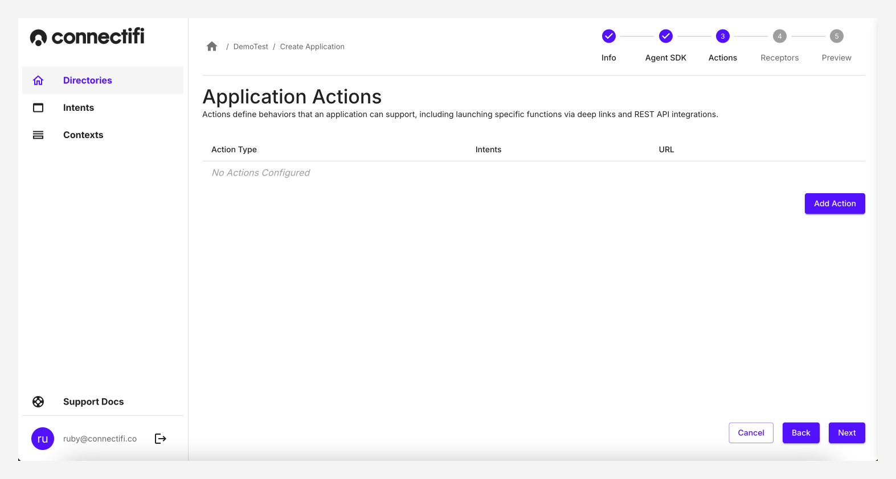

# Actions 

An action an event that is triggered by a user, examples include sharing data with a CRM, receiving inlign data, sending an email, updating a spreadsheet, or posting a message. 

Actions equip your applications to begin a workflow either in-app, or to another application. There are three types of actions:

1. **Data API:** Connect to REST APIs for event-driven data requests between apps.
2. **Deeplink:** Deep links are a type of link that send users directly to an app, with given context. The use of (custom) URL schemes to direct users to specific pages within an app, enhancing user engagement, retention, and improving conversion rates.
3. **Enhanced Deeplinks:** Allows you to connect to custom functions to generate deep links.

## Create an Action

When creating an application, you can add Actions. Click on the top-right of the screen to 'Add Action'. You can add as many actions as you would like. Additionally you can have different types of actions, so even if you only need a deep link action at first, you can later advance to using an advanced deeplink action. 

