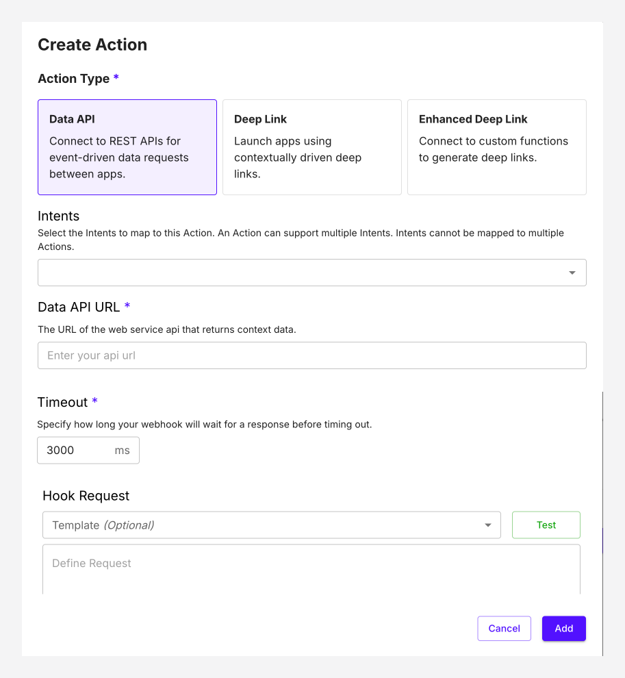

# Data API 

Connect to REST APIs for event-driven data requests between apps.

The Data API action, allows you to add your applications API's to initiate action within your application. This could enable triggering an automated process such as sending a message, or much more. 

- **Data API URL:** The URL of the web service API that returns context data.
- **Timeout:** Specify how long your webhook will wait for a response before timing out.

