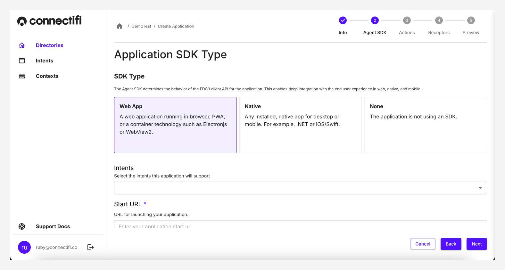
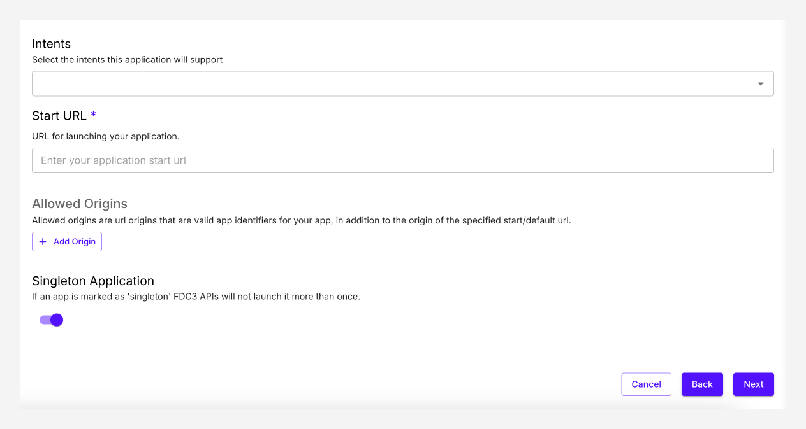
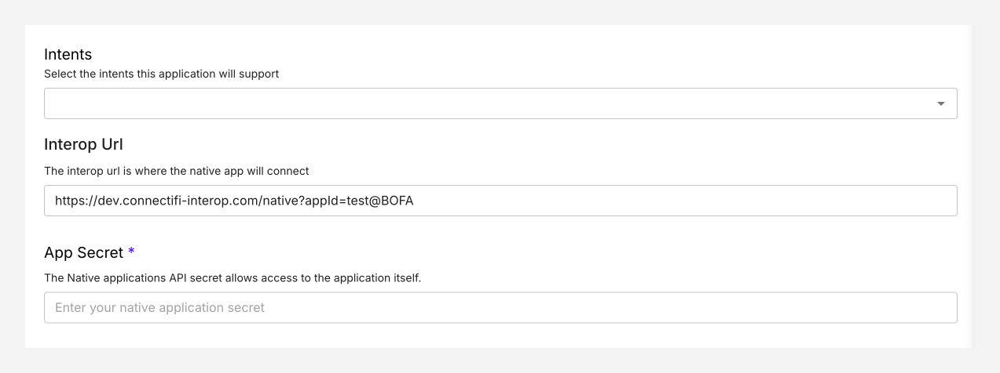

# Applications

Applications are the app that you would like to connect to another application, to receive or send data. An application could be a website, native application, server app, or even a container application such as Electon, or similar.

In order to get your application connected, you'll need to add the application into Connectifi, along with it's Actions and Receptors. Applications are organized into Directories, which can represent team permissions. This means an application needs to be in the same directory as another application in order for them to be able to connect with one another. 

## Creating an Application

Adding your applications to a directory allows them to leverage contexts and intents.

### Step 1: Application Info

1. Open the directory where the application will be located, click on the `Create Application` button in the top-right.

2. **Application Info:** Application info is basic metadata for your app such as name and description. 

-  **Application Name**: This should be a clear unique ID of your application. If you have different versions of the application such as dev, prod, or even a version number, you can prefix or suffix your application name to ensure clarity. Application Name is not changeable in the future.

- **Application Title:** This should be a clear name for your user, as it will be user-visible.

- **Logo:** We recommend a square transparent png logo, in either 124x124 pixels, or 256x256. 

### Step 2: Agent SDK

2. **Agent SDK**: Select the type of **SDK** you want to use in your application

- **Web**: Our WebSDK, works if you are building for the browser in JS, or alternatively if you are using an Electron container or similar. A web application is an application that runs in the browser, or in Electron. It is primarily built using JS, HTML and CSS. Web applications. Our WebSDK can be installed using `npm`. Read more in [our Web SDK Guide](/SDK/Web.mdx)

- **Native**: We offer SDK's for both .Net applications, and iOS/Swift. Checkout our [.Net](/SDK/DotNet.mdx) and [iOS](/SDK/iOS.mdx) guides. 

- **None**: Alternatively if you are building a server side application, or an API, you can get started without using an SDK. 

3. **Intents**: Add the application’s intents. All intents are global, to ensure reusability. Checkout [Intents](Intents.mdx) for more information on how to create these.

#### Web App Fields

**StartURL**: Specify the location of your web app in the "Start URL" field.

**Allowed Origins:** Allowed Origins is optional, and is only applicable when the application is in a strict directories [(See Directories for more information)](Directories.mdx). This setting allows you to specify alternate URLs for your application. Uses for Allowed Origins include:

- Applications using different domains (i.e. localized URLs or)
- Applications that use a "launch" URL that is a different URL from which the app runs

**Singleton Application:** The Singleton Application setting identifies an active instance of the application and continues to use the instance to resolve all intents, rather than launching another instance of the application with each raised intent. It is only used during intent resolution. If an application is marked as a singleton application, users are not provided with an option to open another instance of the application in the resolver modal.

#### Native App Fields

**Interop URLL:** Specify the location of your native app in the "Interop URL" field.

**App Secret:** Add your native apps API key.

### Step 3: Actions

Read more in [our Actions guide](/Actions/Actions.mdx)

### Step 4: Receptors

Read more in [our Receptors guide](/Receptors/Receptors.mdx)

