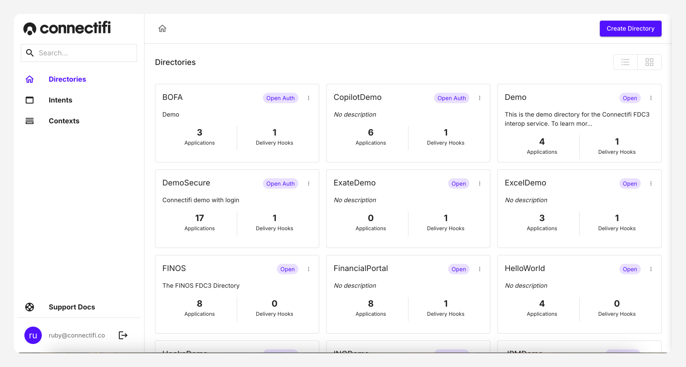
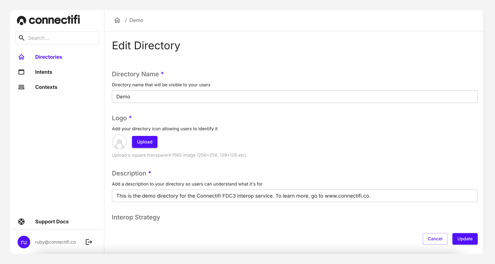
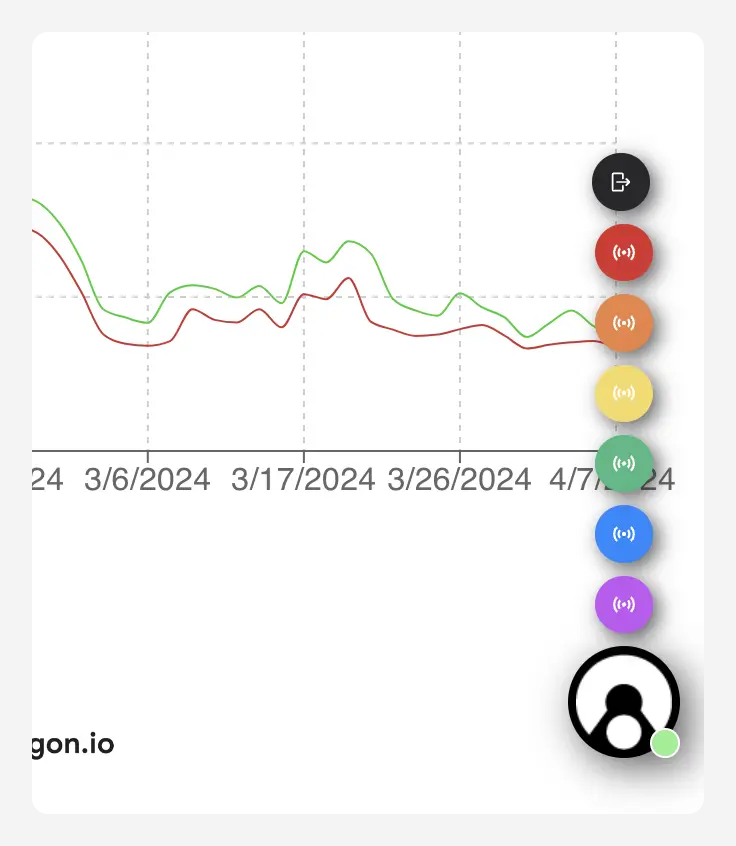

# Channels

Channels provide apps isolated environments to display their data by having the apps join them. A lot can be done with channels in FDC3; below are a few basic concepts to get started.

App channels are very useful when it comes to more advanced orchestration of behavior between applications, especially when there is a singleton or platform application orchestrating a number of child or satellite applications. Some use cases may include:

* Tracking the state of a singleton application across multiple tech stacks
* Publishing application data shared outside of intents or other user actions
* Synchronizing a user state for a session across multiple applications and tech stacks

## Custom Channels

By default, the Connectifi agents has 6 channels available; however, we do allow for the creation of custom channels. Custom Channels are defined at the directory level:



To create custom channels:

1. Navigate to your directory and edit it.
2. Check the "Use Custom Channels" box.
3. Click the "+" button to add a channel.
4. Enter the relevant information for the channel.
5. Select a color for the channel. When selecting a color, you can select one from the color picker or use the eye dropper tool to select a color that exists on your screen; you also have the option of entering RGB/HSL/Hexcode values by clicking the Up/Down button:



6. Add as many channels as you need, and then click the "UPDATE" button to submit your updates to the directory.

Please note that when using custom channels, the default channels are not included in the agent.

## joiningChannels

As mentioned previously, apps can be joined to a user channel (referred to as system channel in FDC3 1.x) by the end user. This links any apps on a channel so that a call to `fdc3.broadcast` is routed to context listeners (set via `fdc.addContextListener`) from any other app on the same channel.

Please note that an app can only be joined to one channel at a time.

Apps can be joined to a channel using either the UI or programmatically. In the UI, you can specify which channel the app is joining by clicking on the Connectifi FAB that appears on screen and then selecting the desired channel:

If you're doing it programmatically, the code would look something like this:

```
 await fdc3.joinUserChannel('red');
console.log('red channel joined!');

// Exiting the channel
fdc3.leaveCurrentChannel();
```

### Joining vs Subscribing to a Channel

Joining a channel, as noted above, impacts the scope of the `fdc3.broadcast` and `fdc3.addContextListener` calls. An app can also explicitly get a reference to a channel and broadcast and/or add listeners to it (subscribing). Some key differences between joining and explicitly attaching to channels are:

Joining a channel can be done by the end user via the UI of the FDC3 provider (e.g. the Connectifi agent UI).
Only one channel can be joined at a time, whereas any number of channels can be subscribed to programmatically.

When a channel is joined, it will automatically receive the current context for the channel. When subscribing to a channel programmatically, the current context needs to be acquired manually.




## Getting a Channel

The getOrCreateChannel function provides a reference to a channel object that can be used to broadcast, assign listeners, and query for context state. For example:
```
    //programmatically subscribe the 'red' system channel
    const redChannel = await fdc3.getOrCreateChannel('red');

    const listener = redChannel.addContextListener('fdc3.instrument', (context) => {
        /* listener logic */
    });

    //get the latest context on the channel
    const currentContext = await redChannel.getCurrentContext('fdc3.instrument');
    
    //broadcast a context on the channel
    redChannel.broadcast(myContext);

    //get or create an 'app' channel
    const myChannel = await fdc3.getOrCreateChannel('myChannel');
```

Please note the `getOrCreateChannel` function can used to either get a user/system channel, or to get or create an app channel. App channels are defined by an application, as opposed to being defined and controlled by the FDC3 provider. Since Connectifi directories can restrict what apps have access to interop in a specific directory, as well as verify the identity of apps connecting into the directory, app channels can have a much higher security profile than on a desktop bus.

