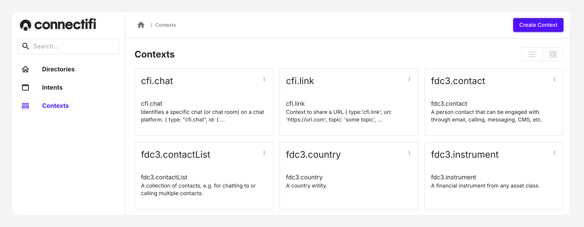
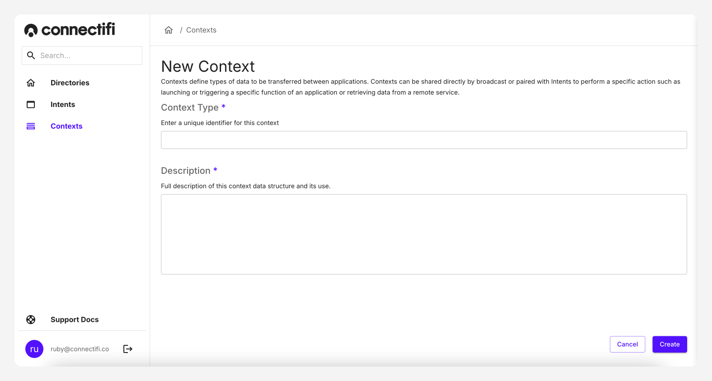

# Contexts

Contexts are the pieces of data/content that can be used by intents and applications. Contexts define types of data to be transferred between applications. Contexts can be shared directly by broadcast or paired with Intents to perform a specific action such as launching or triggering a specific function of an application or retrieving data from a remote service. Contexts can be viewed as having two types:

- Output contexts control active contexts. When an intent is matched, any configured output contexts for that intent become active.
- Input contexts control intent matching.

## Adding Contexts

Additionally, you can use the “Create Context” button to create custom contexts for the directory. To create a custom context:

1. Navigate to the “Contexts” page, from the left-hand navigation. Here you'll be able to see all provided default contexts.
2. Click onto `Create Context` on the top-right hand corner to begin creating an context.
3. **Context Type:** Enter a name for the context. Please note that Context Type needs to be unique, as you will need to reference these within your code.
4. **Description:** This is a Full description of this context data structure and its use.
5. Click the “Create” button to create the context.

