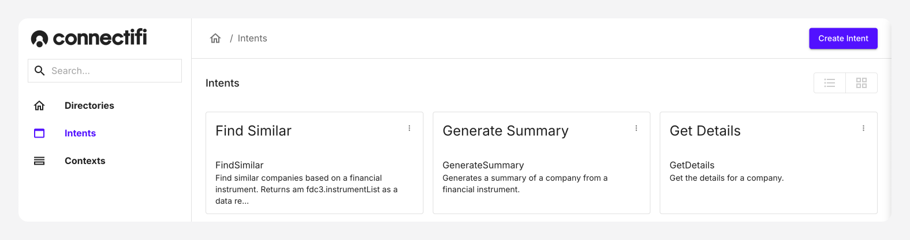
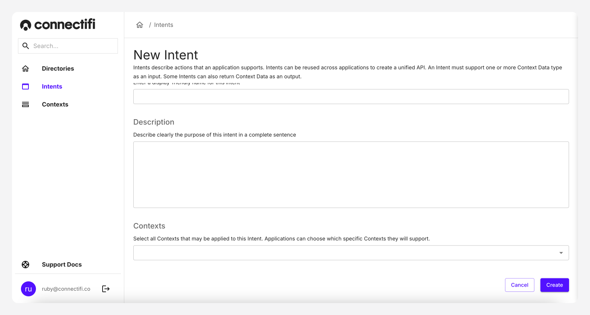

# Intents

Intents are predefined verbs that represent actions applications can perform. Use app intents to express your app's capabilities to the system. An app intent may accept one or more context data types as an input and may return a context data type on completion. App Intents allow you to create a generic grammar that enables plug and play of multiple applications along with end user discovery and choice. 

Intents can be used to launch an application, start an activity, trigger a workflow, call an API, request data, and so on.

Intents are used for discovering and navigating among various activities within the same application, but they are not limited to one single application, i.e., they can be utilized from moving from one application to another as well.

There are two types of intents:

1) Explicit intents specify which component of which application will satisfy the intent. You'll typically use an explicit intent to start a component in your own app, because you know the class name of the activity or service you want to start. For example, you might start a new activity such as running a generative AI to summarize data within your app in response to a user action, or start a service to download a file in the background.

2) Implicit intents do not name a specific component, but instead declare a general action to perform, which allows a component from another app to handle it. For example, if you want to show the user a location on a map, you can use an implicit intent to request that another app show the location on a map. 

## Adding Intents

Intents are created globally in Connectifi, for all directories and their corresponding applications to use. This allows you to create a consistent intent framework. They can be used as much as you would like them to be used. 

To create a custom intent:

1. Navigate to the “Intents” page, from the left-hand navigation. Here you'll be able to see all provided default intents.
2. Click onto `Create Intent` on the top-right hand corner to begin creating an intent.
3. **Intent Name:** Enter a name for the intent. Please note that intent names need to be unique, as you will need to reference these within your code.
4. **Display Name:** Enter a display name that your users will see. Again, we recommend this has uniqueness, so your users do not get confused if they are provided UX that uses both intents, as this can be confusing.
5. **Description:** Describe clearly the purpose of this intent in a complete sentence.
6. **Contexts:** Select the [contexts](Contexts.mdx) the intent can act upon. Please note available [contexts](Contexts.mdx) are created separately. Applications can choose which specific [contexts](Contexts.mdx) they will support, from the one's provided with the intent.
7. Click the “Create” button to create the intent.

## Best Practice for Intents

- **Identify common actions**: Focus on creating intents that people are likely to use frequently: such as looking up information, and recording activity.
- **Trails**: Consider the workflow and trail of your user. for example, if they execute a trade, what will they be likely to do next?
- **Limit your Intents initially**: Create between three and five intents that are relevant to your business at first. Then expand as needed. 

## Default Intents

In order to get started quickly with Connectifi, we offer a series of default intents. One example shown below, is 'Summarize'. Using this you could have multiple generative applications such as OpenAI, or Anthropic using this, to take in data and provide a summary.