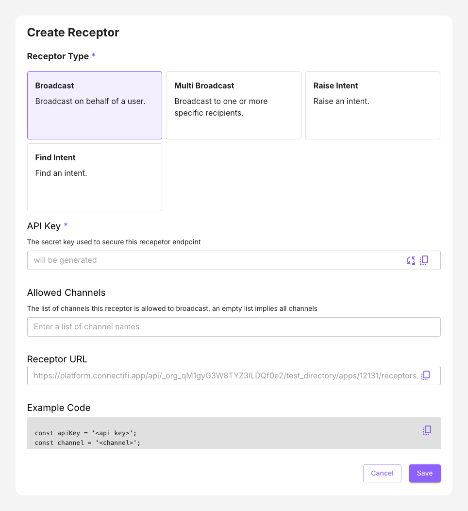

# Broadcast

Broadcast receptor allows the caller to broadcast a context data on behalf of a user.  The data will be broadcast to all connected apps listening for the specific type of context data on the channel.
- `From` header is the email of who you want to perform the broadcast on behalf of. 
- `Allowed Channels`: The list of channels this receptor is allowed to broadcast, an empty list implies all channels

Example use cases include:
 - Side by Side integration with an application where usage of the Agent SDK is not feasible
 - Personalized notifications that are specific to a user, such as a completed transaction, action or workflow
 - Response from an AI LLM Chatbot, specifically for the individuals needs

### Notes

* Broadcasting must be targeted at specific user sessions; the user's email address specifies the session.
* Broadcasts can be to 'User' Channels (i.e. color channels like 'red', 'blue', etc), or 'App Channels' that are application defined. 
* Broadcasts can also be to the 'global' channel.  If a directory has the 'All global broadcasting' flag set, then broadcasting to the 'global' channel will go to all applications **NOT** joined to a User Channel. 

