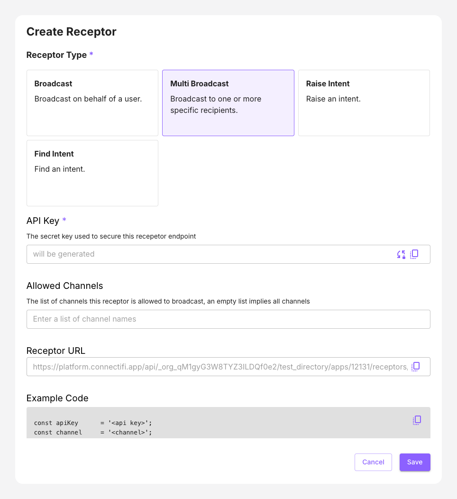

# Multi Broadcast

 This scenario allows you to broadcast contexts to specific recipients. This allows you to inform and update specific users. Example use cases include:

 - Personalized notifications that are specific to a user, such as a completed transaction, action or workflow
 - Announcements to a team of individuals
 - Response from an AI LLM Chatbot, specifically for the individuals needs

