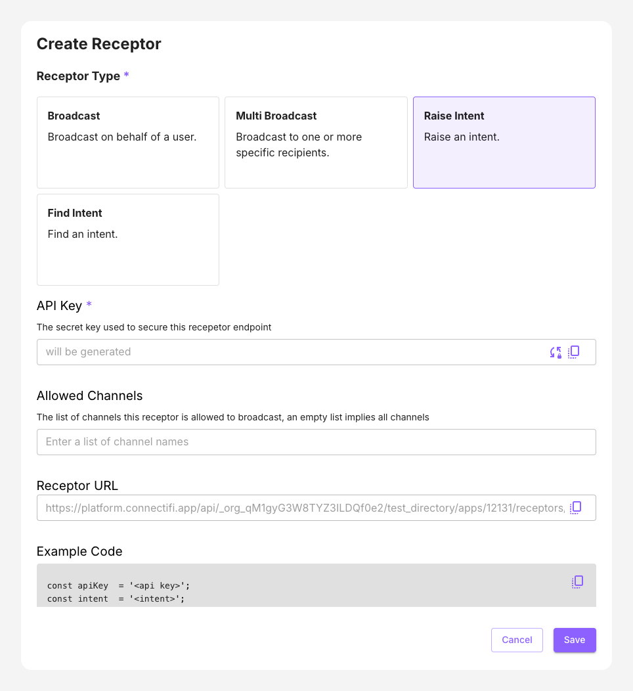

# Raise an Intent Receptor

This scenario lets you raise a sample intent or build a custom one. Select an intent from the grid below, and the Connectifi service will provide you with a list of apps you can route the intent to. The intent can launch either a new app or be raised to an existing app if one is running.

