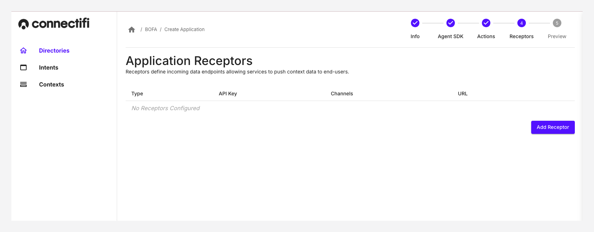

# Receptors

Receptors define incoming data endpoints allowing services to push context data to end-users. A Receptor exposes a web hook URL that can be called by outside services to push messages to users on behalf of the app. Receptor hooks can be used for a wide range of use cases such as:

* Push in-app alerts to users from backend services
* Integrations between FDC3 applications and back-end services and non-FDC3 applications such as CLIs and macros
* Sharing context objects between users.

Receptors equip your applications to:

1. **Broadcast:** This scenario allows you to join a channel and broadcast contexts to other apps, on behalf of a user.
2. **Multi Broadcast:**
3. **Raise an Intent:** This scenario lets you set up intent handlers. Use the form to select an intent to listen for. You can test the listener against a demo app or your app using the panel on the right.

## Creating a Receptor

When creating an application, you can add Receptors. Click on the top-right of the screen to 'Add Receptor'. You can add as 

