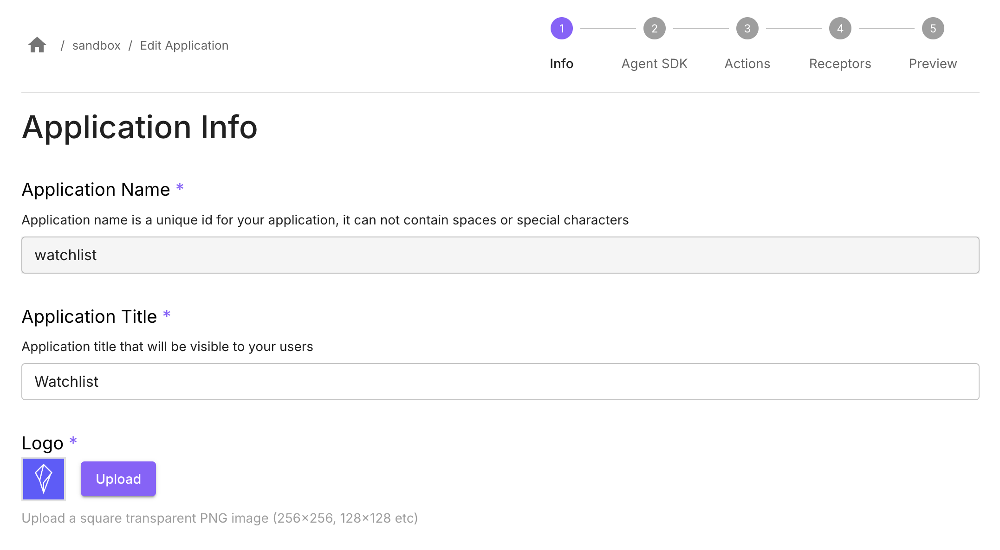
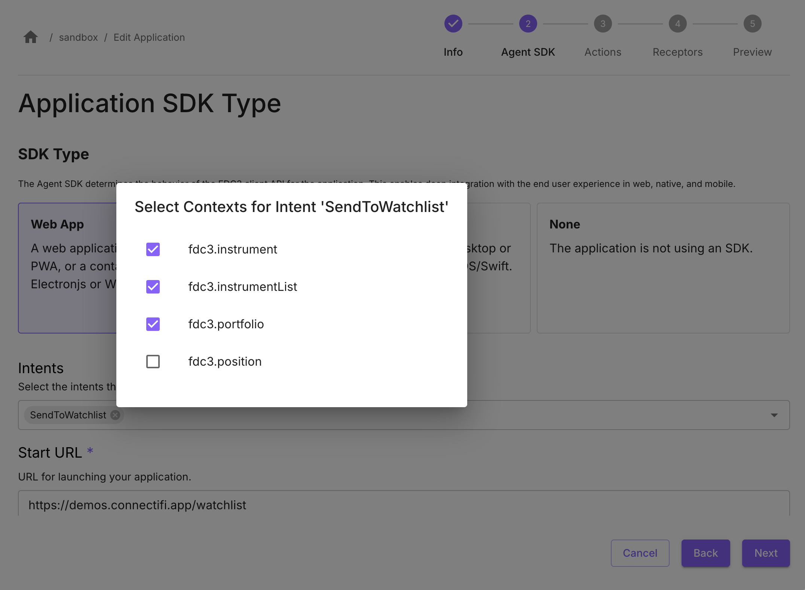

# Watchlist
An interactive watchlist grid built on data from [Polygon.io](https://polygon.io).  Whether you're building a trading app, a robo-advisor, or anything in between, Polygon.io's institutional-level data access can help you make better decisions and deliver better results.

## Application Name
In the **Application Info** step, set *Application Name* as `watchlist`.

## Start URL & Intents

In the **Agent SDK** step, select SDK Type of *Web App*.

Set *Start URL* as (substituting the code for your directory as described [earlier](/Sandbox/Imports)): `https://demos.connectifi.app/platform/{YOUR_DIRECTORY_CODE}/watchlist`

### Configure Supported Intents
This registers the intents the app supports with the directory, so that the app is fully discoverable and can be launched using the *start url* provided.

Select the Intent: `SendToWatchlist`

Select the following supported Contexts: 
- `fdc3.instrument`
- `fdc3.instrumentList` 
- `fdc3.portfolio`

**Note:** once you’ve added an intent, click on the chip for the intent to get the picker list for contexts.

## Finish

Got to the **Preview** step, check your settings, and select *Finish* to save the application.  

Test the app using its Start URL, it should load and connect to the directory. If it has registered intents, it will now be discoverable.