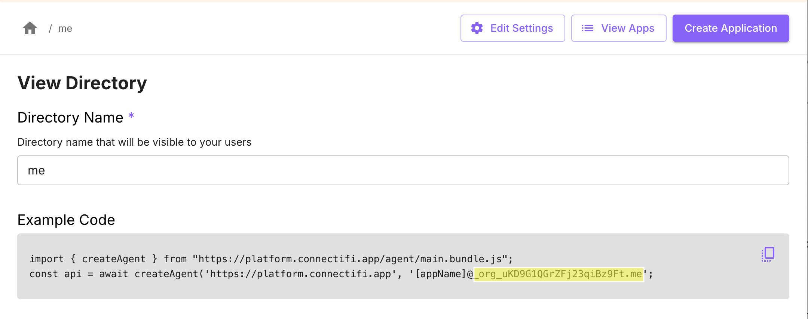
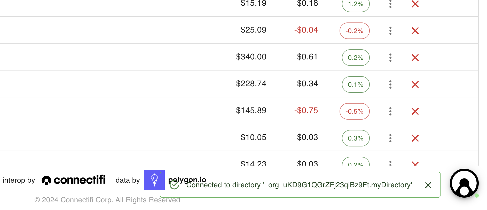
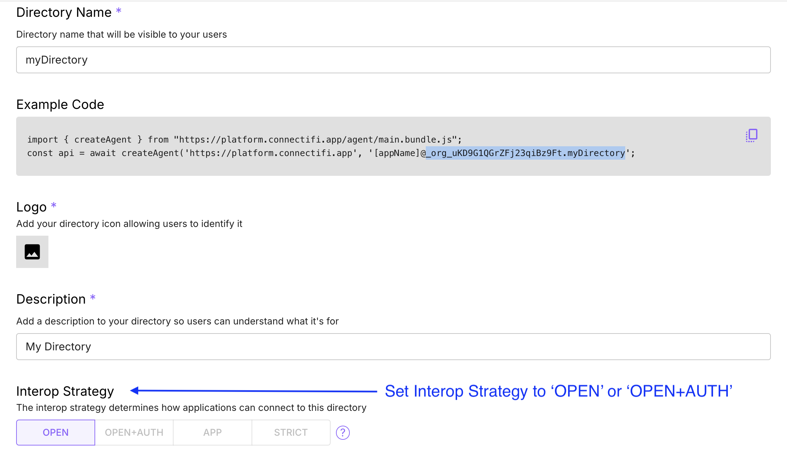
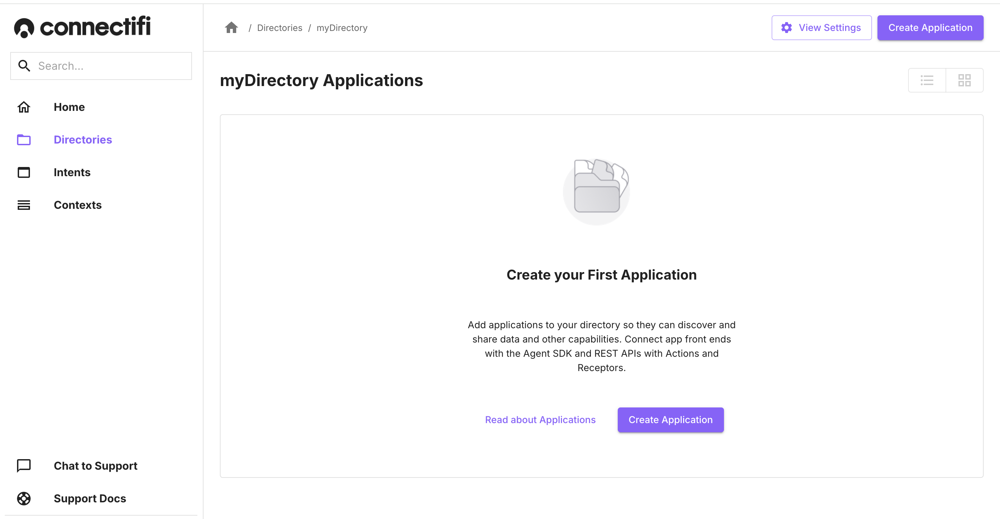

# Importing Demo Apps

Connectifi provides a directory of demo apps that can be used to integrate with your own tests,  demos, and PoCs.  You can see the whole directory here:  [https://demos.connectifi.app](https://demos.connectifi.app)

Apps from the demos directory can be dynamically mapped into other Connectifi directories by changing their path to specify the service instance and directory you’d like the app to connect to.

**Note**: you will need to provide the Directory Code - which is the fully qualified identifier for the directory.  

## Connecting an App

The first step for connecting one of the Connectifi Demo apps to your own directory, is to get your directory code.

### Getting the Directory Code
Go to the settings page for the directory you want to use.  In the `Example Code` section, copy the part of the app identifier after the ‘@’ sign.

### Running the App
To run the Connectifi Sandbox app or any of the Demos Directory apps integrated with your directory, do the following:

- launch the app from [https://demos.connectifi.app](https://demos.connectifi.app)
- insert the service identifier (default is 'platform') and your directory code into the url like so:

`https://demos.connectifi.app/{SERVICE_ID/{DIRECTORY_CODE}/sandbox`

e.g.

`https://demos.connectifi.app/platform/_org_uKD9G1QGrWFj23qiBz9Ft.me/sandbox`

The app will now connect to your directory and be able to interoperate with any other applications in the directory.  
Test the URL - you should see that the Connectifi FAB is active, and displays a toast confirming the connection, like below.

## Importing Apps into Your Directories
Now that you have a URL that will connect the app to your own directory.  You can launch the app and use it in integrations with other apps and services you have defined in the directory.  
**Note:** this will only work if your Directory is defined with an ‘Interop Strategy’ of ‘Open’ or ‘Open & Auth’.  Otherwise, you will need to register the app in your Directory.  Registering the app has other benefits as well.  By registering the intents and URL for the app in your directory, it becomes discoverable and can be automatically launched when not running. 

To add the demo application to your own directory configuration, open up the admin for your directory, and select ‘Create Application’

When re-creating the Connectifi Demos application in your directory, there are number of settings you will need to replicate for the application to fully function.  Below is a guide for how to set up each demo application.