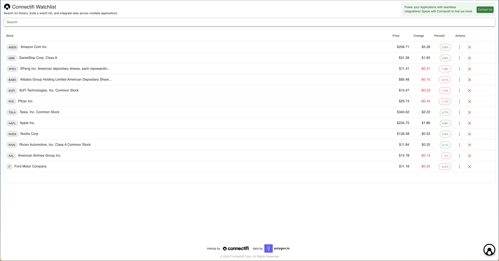
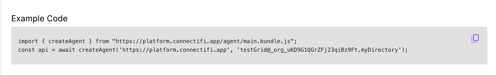
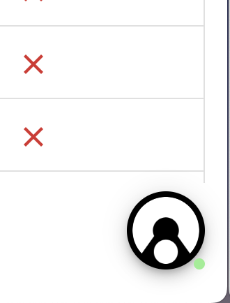
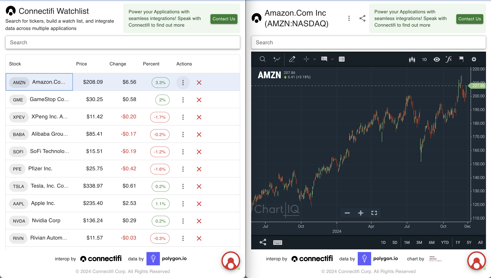
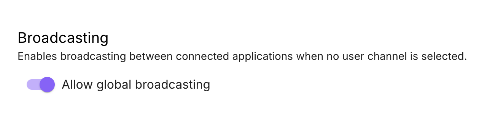
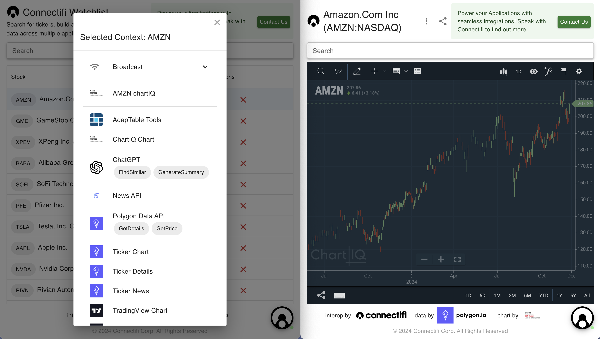
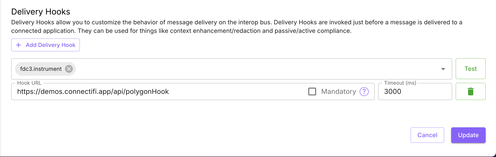

# Working with Grids of Context Data
## Overview
Connectifi workflows are user-centric and data-oriented. The most common use case is a grid of contextually structured data that acts as both a repository for results and a driver of actions for other applications and workflows. For example, a financial user might build up a watchlist from queries in other applications (generative AI, news, analytics, etc.) and then use that watchlist to drive further analysis and action. This recipe shows how to set up a basic grid application that can receive and emit context, serving as both a destination for outputs and a launching point for new workflows.

## Ingredients
You will need the following to build this integration: 

- an account and a directory set up with [Connectifi](https://platform.connectifi.app)
- your front end framework of choice
- ability to host a web app or run it locally

This recipe is not a tutorial on building grid applications.  At Connectifi, we've used the AdapTable Tools Grid, MUI XGrid, and AG Grid.   All of these and many others are fine choices for grid functionality depending on your specific needs and preferences.  

Once you have a grid choice made, you’ll want to bind it to a specific context data type.  For this example, we are going to use the `fdc3.instrument` context data type.  Mostly because there are  a number of existing demos we can easily integrate with that use `fdc3.instrument` as their primary context type.  

## Putting It All Together
This recipe is based on the Connectifi Watchlist app (pictured below).  You can try the app out live at: [https://demos.connectifi.app/watchlist](https://demos.connectifi.app/watchlist).  **Note:** code given here is simplified example code and will vary from what is used to construct the watchlist.


### Create Your Directory and App Connection
If you have not done so already, go to [https://platform.connectifi.app](https://platform.connectifi.app) and create a directory.  When setting up your directory, we recommend starting with an Interop Strategy setting of ‘Open’ or ‘Open + Auth’ .  This just makes it easier to add apps while your developing, as the specific URL does not have to be registered in the directory.  Once your ready, you can lock that down with a setting of ‘Strict’ or ‘App’.  

After you’ve created your directory, add an entry for your grid app.  Set  Agent SDK to ‘Web’ and add the URL for launching your grid app.

Save your app entry and copy the connection code from the preview screen.



Use the connection code in your app to obtain an FDC3 API.

Opening your app, you should see the default Connectifi FAB in the lower right, indicating a successful connection.



### Setting Up the Grid
The Watchlist app uses the `@mui/x-data-grid` component - which is a pretty standard React data grid. You can read more about it [here](https://mui.com/x/react-data-grid/).  This is for example only and all of the concepts should apply to any other grid component.

To set up your grid, you will need a mapping of `fdc3.instrument` context data to the columns you want to display, plus any additional data you want to map onto the instruments and any synthetic columns that don’t correspond to data.  

For example, in the above illustration, the *name* and *id.ticker* fields from the context data are mapped into the 'Name' column.  The 'Price', 'Change', and 'Percent' fields are taking their values from data mixed into the context data set from Polygon.io.  The ‘Actions’ column is synthetic (and using the context data for the row under the hood). 

The code for the grid looks something like this:

```javascript
        <DataGrid
          rows={instruments}
          columns={instrumentCols}
          hideFooterPagination={true}
          getRowId={(row) => {
            return row.ticker;
          }}
          getRowClassName={(params: GridRowParams) => {
            return params.row.ticker === currentTicker ? 'highlighted-row' : '';
          }}
          
          onRowClick={(params: GridRowParams) => {
            fdc3.broadcast(createInstrumentContext(params.row.ticker, params.row.name));
          }}
        />
```

### Broadcasting
Use the Agent SDK to broadcast context data from the grid with the FDC3 API.  For example:

```javascript
const createInstrumentContext = (ticker: string, name?: string): Context => {
  return {
    type: 'fdc3.instrument',
    name,
    id: { ticker },
  };
};
....

onRowClick={(params: GridRowParams) => {
            fdc3?.broadcast(createInstrumentContext(params.row.ticker, params.row.name));
 }}
```
Broadcasts will go over whatever channel the app is joined to and be received by whatever apps are listening to that channel (joined or explicitly subscribed) for the context data type being broadcast.  Typically, users join what are called user channels - by default, the colors available from the FAB.  



Directories can also be configured to broadcast without a channel being joined.  This setting is called ‘Allow Global Broadcasting’



You can also broadcast to specific channels, rather than what the user has joined the app to.  These can even be ‘app channels’ created by the application.

```typescript
onRowClick={async (params: GridRowParams) => {
		const channel =  await fdc3.getOrCreateChannel('myChannel');
    channel.broadcast(createInstrumentContext(params.row.ticker, params.row.name));
 }}
```
To learn more about channels and broadcasting, read the docs at: [https://docs.connectifi.co/Channels](https://docs.connectifi.co/Channels)

### Raising Intents
For it’s ‘actions’ menu, the grid uses the `fdc3.raiseIntentForContext` API.  This method sends a context data to the service to discover all intents and applications that are applicable.  This is similar to the ‘share tray’ flow on mobile and provides a versatile user experience for working with dynamic sets of data and capabilities.  



**Note:** the UX for the intent dialog on [demos.connectifi.app](https://demos.connectifi.app) is built using the customization APIs from Connectifi’s Agent SDK.  Learn more about this below and in our open source Getting Started repo.

### Receiving Data and Intents
A grid of data may also want to receive in bound intents and broadcasts from other applications to either append to the grid’s data set or execute other functions like search, update, or delete.

For the example Watchlist grid, we’ve added a `SendToWatchlist` intent that can take either an `fdc3.instrument`, `fdc3.instrumentList`, or an `fdc3.portfolio` context and has different behaviors depending on which context is sent with the intent.  For example:

```javascript
    fdc3?.addIntentListener('SendToWatchlist', async (context) => {
      if (context.type === 'fdc3.instrumentList') {
        await addInstrumentsToList(context.instruments as Array<Instrument>);
      } else if (context.type === 'fdc3.portfolio') {
        const instruments = context.positions.map((position: Position) => {
          return position.instrument as Instrument;
        });
        await addInstrumentsToList(instruments);
      } else if (context.type === 'fdc3.instrument') {
        if (context.id?.ticker) {
          addToList({
            ticker: context.id.ticker,
            name: context.name || '',
            lastUpdate: 0,
          });
        }
      }
    });
```

## Embellishments

Now that we have the basics working, we can take the grid to the next level with additional features supported by the Connectifi Platform.

### Customizing the Agent UX
When you load the agent from the NPM module or from the Service CDN, there is a default UI it will provide.  However, there is also a rich and full featured API for customizing the UX for Connectifi in your application.  You can get the full details from the API documentation here: [https://docs.connectifi.co/SDK/Web](https://docs.connectifi.co/SDK/Web) and a wide number of examples from the open source Getting Started repository here: [https://github.com/connectifi-co/getting-started](https://github.com/connectifi-co/getting-started)

### Decorating the Grid Data
Context data typically consists of identifiers and other ‘connective’ data between systems.  So, it is common for a receiver this data to further enhance it with other data sources before displaying.  This can be done through a number of means including standard REST APIs and fdc3 Intents APIs.  For example, the GetDetails intent can be used on a `fdc3.instrument` context to get additional reference data for a company.  

```javascript
const detailsResponse = await fdc3.raiseIntent('GetDetails', context);
const details = await detailsResponse.getResult();
const enhancedData = {...context, ...details);
```

### Using Delivery Hooks
You can also use the Connectifi Delivery Hook system, configurable per/directory, to decorate context data going into the grid.   In this case, when context is broadcast to the grid or sent via an intent, it can be enriched with additional information, which can then be displayed in the grid. 

To set up a Delivery Hook, go to the directory settings and add a hook for the context data type(s) you want to target.  Refer to the open source Connectors project for specific examples of delivery hooks and other connectors.



## Cleanup & Next Steps
Once you have a basic data grid working and acting as a trigger for interoperability with Connectifi workflows, there are a number of next steps to think about.   

- If you have dynamic data, providing an event stream off the grid as an *app channel* the grid is publishing to.
- Plugging in additional inputs to your grid through Receptors.  For example, to receive push data from external services.
- Expanding the type of context data your grid can supporting as an input by providing the mapping in the grid application.  For example, supporting `fdc3.position` and `fdc3.organization` context types and mapping as `fdc3.instrument` into the grid.