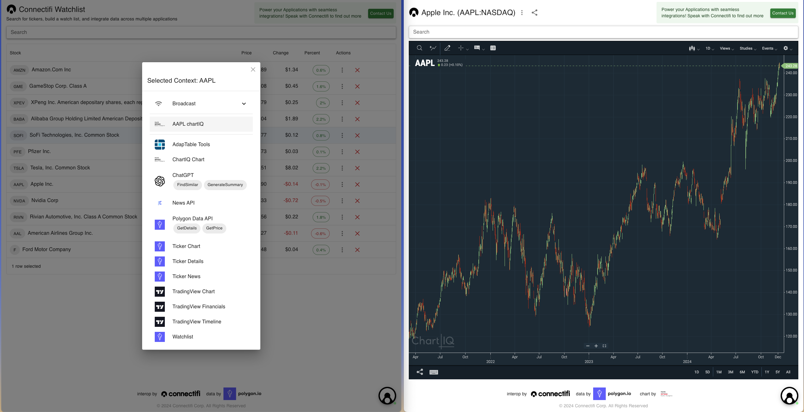
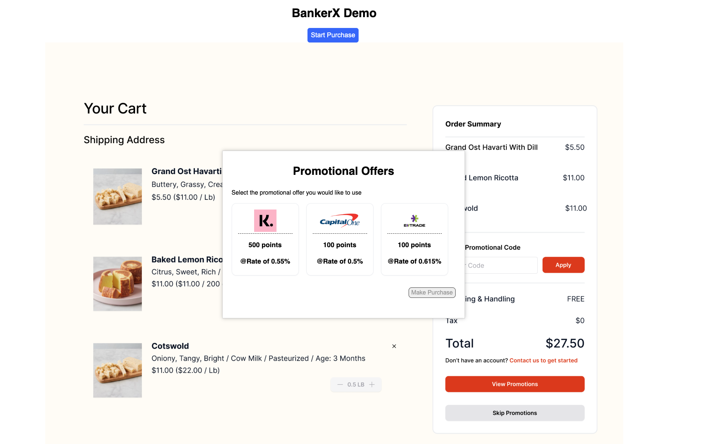
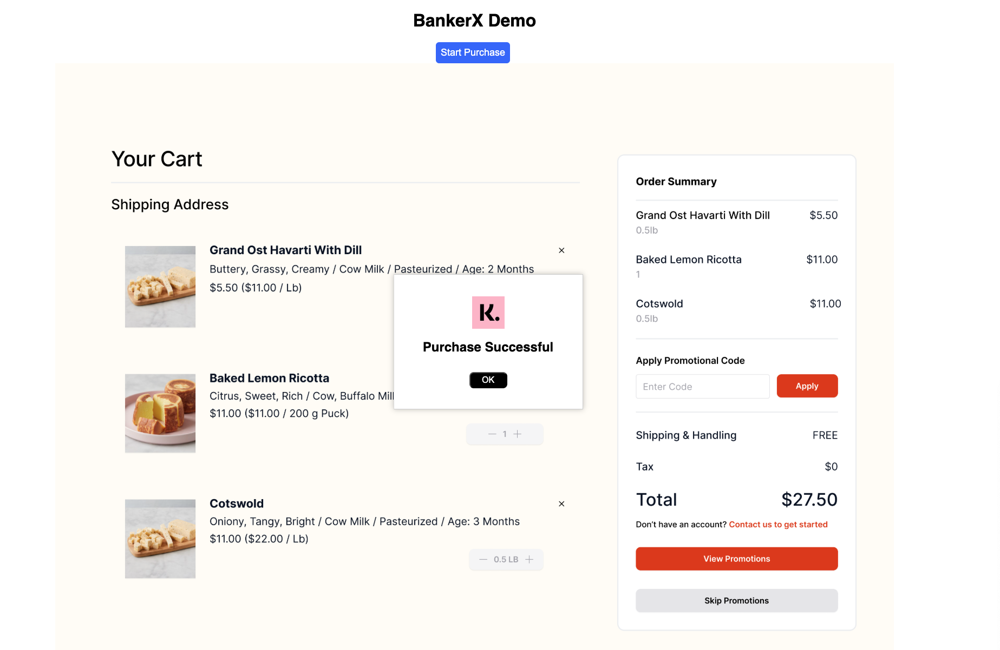
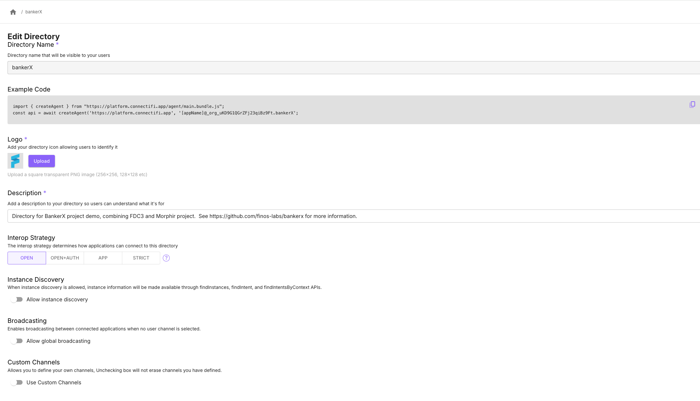
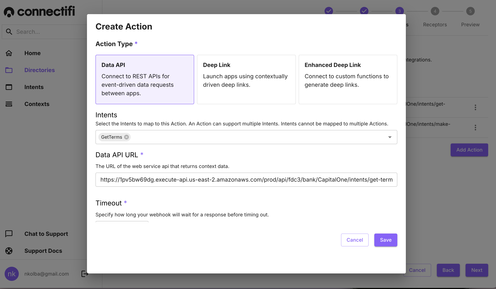
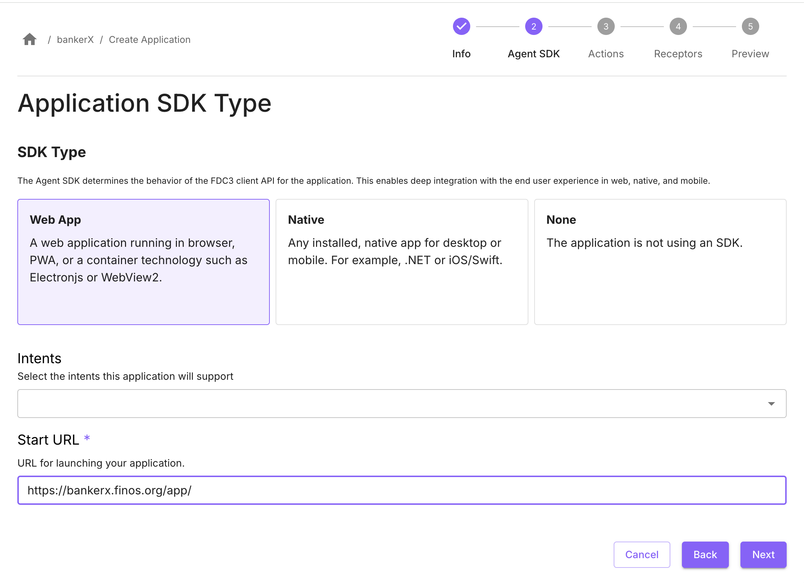

# Building Multi-Step Intents and Discovery
## Overview
Intents are the most powerful and durable part of the FDC3 Standard.  Intents, as a concept, are used broadly in interoperability tech from Android Intents, the more recent Apple Intents, to Agentic Intents in LLMs.

In FDC3, intents have largely been a simple mechanism of providing a list of options and launching the user choice.



While, this single-step resolution process can be powerful, it can only support very simple workflows.  Intents workflows that let an end user walk through a multi-step process from a single UI can be far more effective and productive.

With this recipe, we’ll look at one example of a multi-step workflow and the concepts involved.

## Ingredients
This recipe uses the open source project called [BankerX](https://github.com/finos-labs/bankerx)  - which brings together two open source projects: [FDC3](https://fdc3.finos.org) and [Morphir](https://morphir.finos.org) - both  of which are part of the [FINOS](https://finos.org) foundation.  Connectifi was used to implement the example solution.  You can see a live example here:  [https://bankerx.finos.org/app/](https://bankerx.finos.org/app/)

To implement this, or similar multi-step intent workflow, you will need:

- an account and a [directory](https://docs.connectifi.co/Directories#creating-directories) set up with [Connectifi](https://platform.connectifi.app)
- your front end framework of choice
- one or more REST APIs to call as Actions

## Putting It All Together

The BankerX demo consists of a simple, mock e-commerce site that uses the Connectifi FDC3 Agent to create an intent workflow that initiates a reverse auction for a purchase between a number of credit card apps.   

The steps are as follows:
- the end user requests terms for a purchase, and receives a set of terms from 3 different apps


- Then end user can then chose a bank and execute the purchase


Behind the scenes, there are a number of moving parts going on here.  Let’s take a look.

### Directory Setup
For the BankerX demo, we just created a basic directory with an Interop Strategy of ‘Open’.  Its configuration looks like this: 



### Terms & Purchases, Intents & Contexts
The original FDC3 intents and context data definitions typically revolve around ‘fire and forget’ patterns like viewing a chart for a ticker or starting a chat.  Multi-step intents often involve intents that return data that are then used in a subsequent intent.  So, there is usually some intent and context data modeling to do when creating Multi-step workflows.  

For the BankerX demo, we created the following intent and context data definitions.

Intent `GetTerms` that takes a `fdc3.purchase` context data and returns a `fdc3.terms`context data.  

Intent `MakePurchase` which takes a `fdc3.purchase` context data and returns a `fdc3.purchaseConfirmation`

fdc3.purchase Interface

```typescript
interface Purchase extends Context {
    type: 'fdc3.purchase';
    data: {
      amount: number;
      vendor: string;
      date: string;
      time: string;
      userID: string; //is there a common identifier for the purchaser?  do we even want to include this (or is this too much PII)?
      pointOfSale: string; //identifier for the merchant/point of purchase - is there a common identifier
      category?: 'Groceries'
                  | 'Dining'
                  | 'Home'
                  | 'Shopping'
                  | 'Travel'
                  | 'Fuel';
      }
}
```

fdc3.terms Interface

```typescript
interface Terms extends Context {
   type: 'fdc3.terms';
   data: {
      points: number;
      rate: number;
      provider: string; //display name of bank providing terms
      providerId: string; //identifier of bank providing terms
   }
}
```
fdc3.purchaseConfirmation Interface

```typescript
  interface PurchaseConfirmation extends Context {
     type: 'fdc3.purchaseConfirmation';
     data: {
        provider: Provider;
     }
  }
```
### Add The Bank Apps & Actions

The BankerX demo uses 3 bank applications that each support 2 actions, one for each of the intents in the workflow:

- GetTerms
- MakePurchase

Each action points to a REST API end point.  The API receives the intent and context data in a POST and responds with the resulting context data, which is then routed back to the client application via the FDC3 API.

To set up the application and action:

- Enter the basic application information: *name*, *description, logo*, etc.
- Set the *Agent SDK Type* to ‘None’
- In *Actions,* add an action of type ‘Data API’ for the intent `GetTerms` and enter the URL endpoint
- In *Actions,* add an action of type ‘Data API’ for the intent  `MakePurchase` and enter the URL endpoint
- *Finish* and save the application



Finally, add an entry for the demo app where the UI will live and configure its Agent SDK with type of ‘Web App’ with a Start URL for the demo.



### Resolver Flow & UX
Now that the directory is all configured, we will set up the UX for the resolver in the application.

The front end application code does the following when the user clicks ‘Start Purchase’

- It calls `fdc3.findIntent` for the *GetTerms* Intent.  This returns a list of applications that supports the intent.
- Then, for each application returned, a targeted `fdc3.raiseIntent` is called for *GetTerms*.  This will fetch the terms from the REST API set up by the Action.

```javascript
const appIntents = await fdc3.findIntent('GetTerms',purchase);
...
  appIntents.apps.forEach(async (app) => {
      const result = await fdc3.raiseIntent('GetTerms', purchase, {appId: app.appId});
      const contextData = await result.getResult();            
      renderBankResult(contextData.data);
  });
```
- The terms are then displayed, and when one is selected and the end user clicks ‘Purchase’, the *MakePurchse* intent is targeted to the selected application.

```javascript
 purchaseButton.addEventListener('click', async () => {
  const purchaseResponse = await fdc3?.raiseIntent('MakePurchase', purchase, selected);
  const purchaseResult = await purchaseResponse.getResult();
  hideModal();
  showSuccessModal('Purchase Successful', purchaseResult.data);
 });
```
- This routes to the second REST API configured by the Action and the resulting data response is displayed.

## Embellishments

### Making It Real 
The BankerX example is just an example.  The applications are not hooked up to any banking front end.  However, the concepts are real and it would be awesome to prove this out end to end in a full e-commerce scenario!

### More Data Intents Handling
This recipe leans heavily on the mechanics of data intents, which are a relatively new concept in FDC3 and one that is often under-utilized in other systems, because of the reliance on client side desktop tech means that data needs to come from front end applications.  Being able to plug in REST APIs directly to FDC3 opens up a whole new world for this standard and is one that we are just beginning to explore.

### Use Cases Beyond BankerX
The broad strokes of the use case detailed here is a reverse auction - i.e. the banks are bidding for the shopper’s purchase.  There are many other viable use cases for this kind of flow whether it is Capital Markets RFQs, insurance purchasing, or ordering pizza.  

## Clean up & Next Steps
As multi-step intents evolve, we expect to see many more intents and context data definitions to be drafted.  Ultimately, we want these to be field tested, and the ones that get traction to go through the standardization process.  Reusability and discoverability of Actions and APIs will become critical too as the use cases mature and progress.