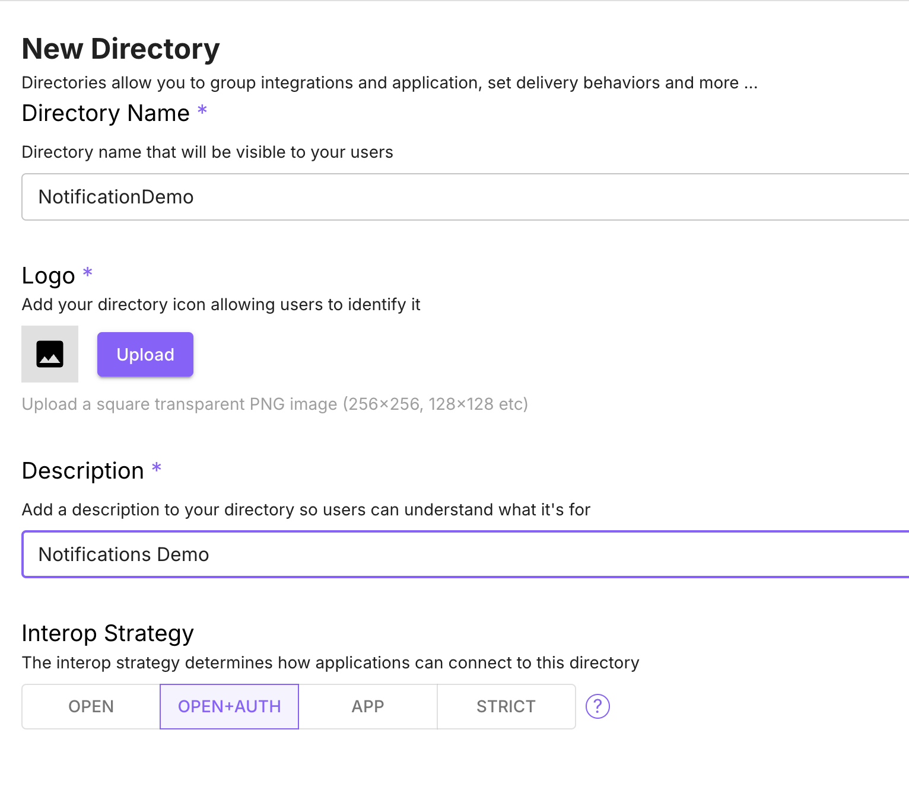
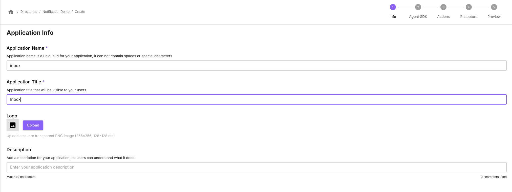
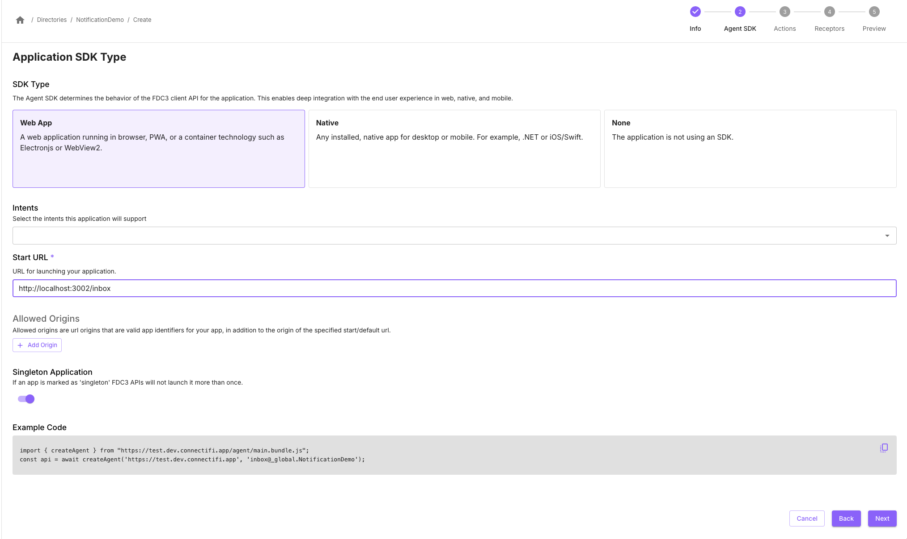
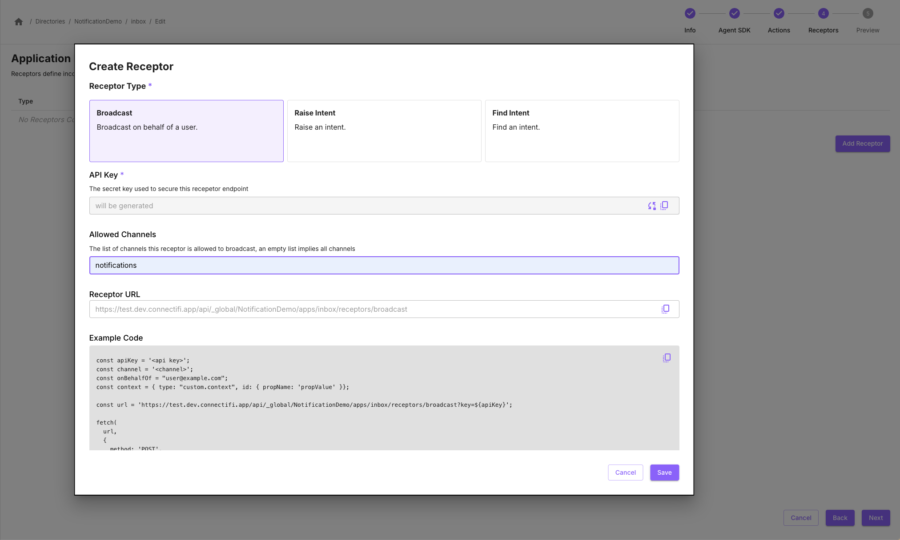
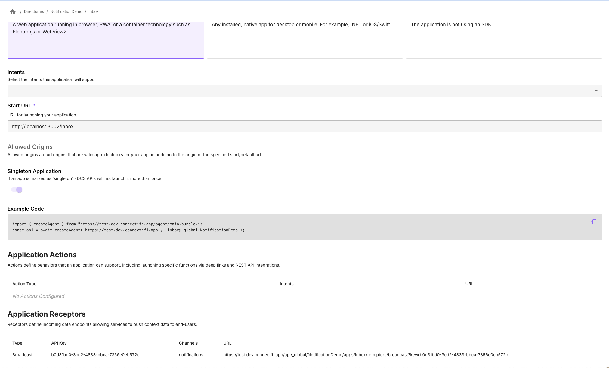
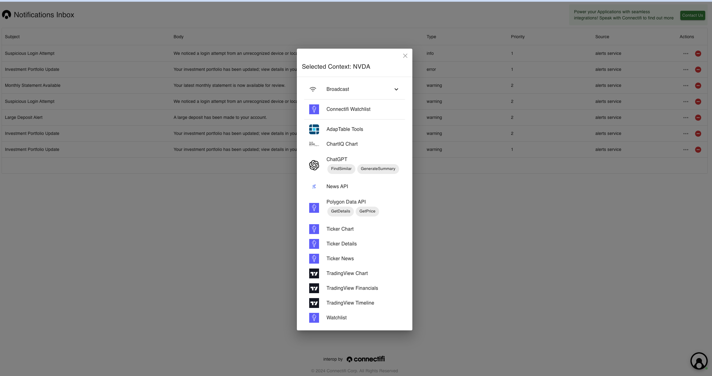

# Building a Notifications Inbox
## Overview
Notifications delivery is not typically considered a core interoperability use case. However, Connectifi’s message aggregation and routing capabilities, combined with client agnostic delivery makes it a natural for solving many core challenges with notification systems today.  Furthermore, interoperability provides key benefits to the actionability of notifications after delivery.

## Ingredients
You will need the following to build this integration: 

- an account with [Connectifi](https://platform.connectifi.app) and a directory configured with auth
- a receptor and inbox app
- one or more notification sources

### Notification Context Data
This recipe uses the `connect.notification` context data type for relaying notifications.

```typescript
interface Notification extends Context {
    type: 'connect.notification',
    id: string,
    subject: string,
    body: string,
    alertType: string,
    priority: number,
    source: string,
    context?: Context
}
```

## Putting It All Together

### Configuring the Directory
Notifications use *Application Receptors* which require user identity to be able to push notifications to user sessions.  So, you will need to create a directory with a `Interop Strategy` of either ‘Open+Auth’ or ‘Strict’.



### Create the Inbox App
In your directory, add an application that will serve as the inbox for notifications.  This app will also host the receptor for notifications from outside services.  



Add a ‘Web App’ Agent SDK for the application and point it to what will be the dev URL for your inbox app.



Later on, you can also add intents support to allow end user applications to perform additional functions with the inbox app.

### Add the Receptor
Go to the ‘Receptors’ step of the Application creation wizard and add a Receptor of type ‘Broadcast’.

Enter ‘notifications’ into the the *Allowed Channels.*



Save your application and view it.   Copy the URL for the Receptor from the Application Receptors section.



### Test the Receptor

With Postman or Curl, test the Receptor by posting to the URL for the receptor.  

Add a `From` header with the email of the user session you want to send the message to.

Use a JSON body with the following structure:

- channel: name of the channel you want to broadcast to

You should get a 200 response back.

For example:

```Curl
curl -H "From: nick@connectifi.co" -d '{
    "channel": "notifications",
    "context": {
        "type": "connect.notification",
        "subject": "notification test",
        "body": "this is also a test of a notification",
        "alertType": "info",
        "priority": 1,
        "source": "app",
        "context": {
            "type": "fdc3.instrument",
            "id": {
                "ticker": "MSFT"
            }
        }
    }
}'  https://test.dev.connectifi.app/api/_global/NotificationDemo/apps/inbox/receptors/broadcast\?key\=7f6cb06c-3dc4-4538-a8ff-46e83577ef86
```

### Make the Inbox UI
Use a grid widget to make a simple inbox for your notifications.

Subscribe to the ‘notifications’ channel and append new notifications to the list.  E.g.:

```javascript
const channel = await fdc3.getOrCreateChannel('notifications');
channel.addContextListener('connect.notification', (context) => {
	appendToList(context);
});
```

### Handling Notification Context
The connect.notification context type has a context property that allows for embedding of a context data that informs the notification.  For example, a price alert on a stock might look like this:

```javascript
{
  "type": "connect.notification",
  "id": "1-2-3-abc",
  "subject": "Price Alert: NVDA",
  "body": "Nividia's price went up again!",
  "alertType": "priceAlert",
  "priority": 1,
  "source": "pricingService",
  "context": {
      "type": "fdc3.instrument",
      "name": "Nvidia Corp",
      "id": {
	        "ticker": "NVDA"
      }
  }
}
```
Within your inbox, you can then use this embedded context as a jumping off point for the next step in a workflow.  The best way to do this is with the `raiseIntentForContext` API, which will provide the end user with all application and intents that can be applied to the data.   For example:



## Embellishments
### Adding Notification Services
Now that you have a full loop working using curl or Postman to push notifications to your inbox, you can use the Receptor endpoint to receive notifications from any number of sources.  You can also route different kinds of notifications on different channels for both semantics of applications consuming the notifications as well as improved security and management of the Receptors.

### Notifications from End User Applications
Connectifi supports aggregation of notifications from Web Services via Receptors (as above) and sent from end user applications leveraging FDC3.  This capability enables platforms to create comprehensive solutions where all types of notifications from any source can be brought together without additional technical lift.  Building on the example above, any application loading the Web Agent SDK or Native Agent SDK  (e.g. for .NET or iOS) can send a notification into the inbox using code like this:

```javascript
const channel = await fdc3.getOrCreateChannel('notifications');
channel.broadcast('notifications', {
  "type": "connect.notification",
  "id": "1-2-3-abc",
  "subject": "Price Alert: NVDA",
  "body": "Nividia's price went up again!",
  "alertType": "priceAlert",
  "priority": 1,
  "source": "application",
  "context": {
      "type": "fdc3.instrument",
      "name": "Nvidia Corp",
      "id": {
	        "ticker": "NVDA"
      }
  }
});
```

### Multi-Channel Delivery
Just as notifications can be sent from anywhere, with Connectifi, notifications can be aggregated into an inbox running anywhere.  For simplicity, this example uses a browser target as its default.  But notifications can be received and rendered on a phone, in a desktop container, in a native desktop application, or across multiple targets depending on user context and preference.  

## Clean Up & Next Steps
### Persisting Notifications
In Connectifi, Context is persisted in channels for a user session.  From an application, you can use the FDC3 APIs to get the last context posted to a channel.

```javascript
const channel = await fdc3.getOrCreateChannel('notifications');
const lastNotification = await channel.getCurrentContext('connect.notification');
```
Your app can also choose to persist notifications - either through local storage in the browser or via its own backend. 

Mechanisms like *Delivery Hooks* can also be used to write context to an external DB as it’s broadcast.

### Intents Receptors
This recipe focused on using the Broadcast Receptor type.  But, the RaiseIntent receptor can also be leveraged for similar use cases.  Note: the RaiseIntent receptor will return a list of possible targets if the intent resolution is ambiguous.  This can allow the external service to implement its own business logic for targeting notifications.  So be sure that any implementation is taking targeting logic and responses into account.

### Rotating API Keys
Receptors use an API Key to authenticate calls.  Be sure these keys are kept secret, are not shared, and are not stored in application code.  We recommend that you rotate keys by making multiple receptors and retiring and regenerating keys on an ongoing basis.