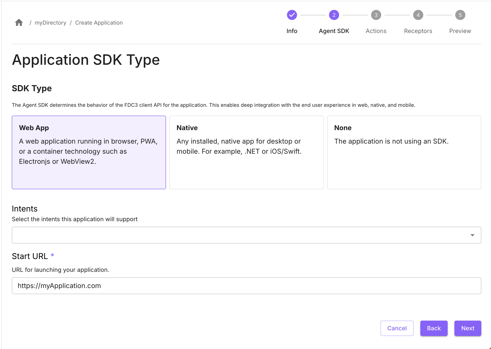
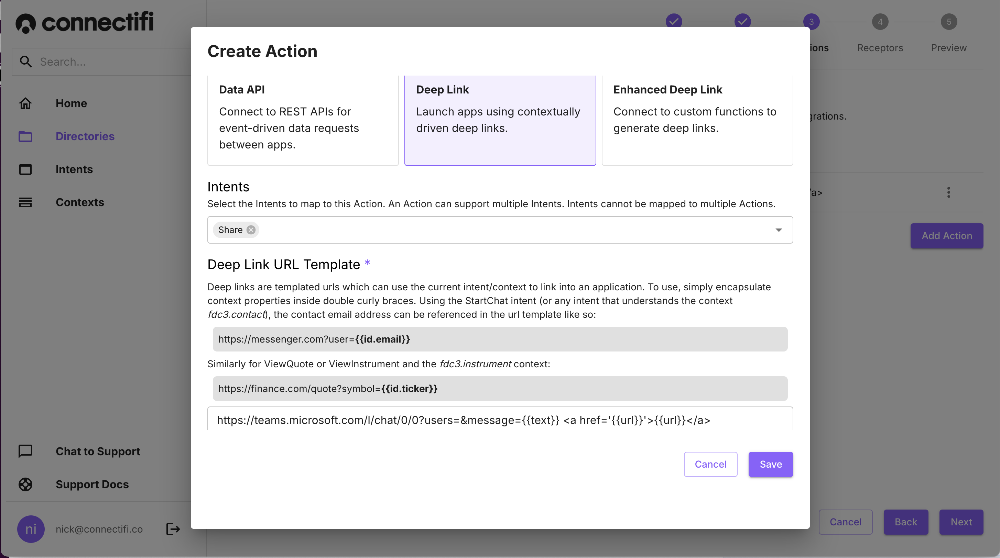
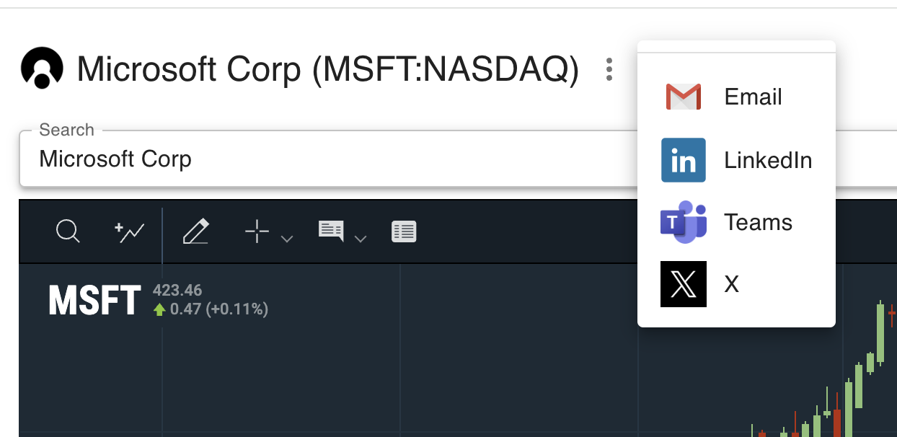

# Creating a Share Function
## Overview
Sharing content through direct messages and social media is the most common interoperability use case. While any content with a link can be shared, integration features help eliminate the friction of manual copy-and-paste steps.

## Ingredients
You will need the following to build this integration: 

- an account and a [directory](https://docs.connectifi.co/Directories#creating-directories) set up with [Connectifi](https://platform.connectifi.app)
- an app that has URL driven content

## Putting It All Together
To implement sharing, we will use the `connect.link` context data type.  This context data is used by the `Share` intent to identify a link and related metadata.  The interface for this type is as follows: 

```typescript
interface ConnectLink extends Context {
	type:’connect.link’;
	title: string;
	url: string;
	text: string;
	linkType: ‘website’ | ‘file’ | ‘application’;
}
```

### Raise the Share Intent
In the application you want to enable sharing from, add the *Web Agent SDK* by enabling is in your application’s configuration and using the provided code snippet to import the SDK and connect the application.



Next, in your application code, add the code to raise the `Share` intent.  This could be triggered from a button or any other CTA appropriate for your app.  Here is some example code based on what we use in the [Connectifi Demos Directory](https://demos.connectifi.app/chartIQChart#ticker=MSFT):

```javascript
 <IconButton
      onClick={(event) => {
      fdc3.raiseIntent('Share', {
        type: 'connect.link',
        url: document.location.href,
        title: pageTitle || defaultPageTitle,
        text: 'Check out this app powered by Connectifi!'
      });
    }}>
    <ShareIcon />
  </IconButton>
```

### Adding Deep Link Actions
Now that you are raising the `Share` intent, you will need to add some apps in your directory to handle it.  For many platforms that are typically shared with, we can leverage deep link APIs and Connectifi Deep Link Actions to rapidly create integrations.  Deep Links Actions will map an intent to a deep link template and push the generated URL to Agent SDK to launch.  So, rather than hard-coding sharing links in your applications, you can now just raise an intent and have a menu dynamically generated. 

### Teams Application
To add sharing for Teams, add an application entry for Teams in your directory (no Agent SDK needed) and add an Action with the type *Deep Link*.

Add the *Share* Intent for the Action and configure it with this URL Template:

`https://teams.microsoft.com/l/chat/0/0?users=&message={{text}} <a href='{{url}}'>{{url}}</a>`



### LinkedIn Application
To add sharing for Linked, add an application entry for LinkedIn in your directory (no Agent SDK needed) and add an Action with the type *Deep Link*.

Add the `Share` Intent for the Action and configure it with this URL Template:

`https://www.linkedin.com/feed/?linkOrigin=LI_BADGE&shareActive=true&shareUrl={{url}}`

### X Application
To add sharing for X, add an application entry for X in your directory (no Agent SDK needed) and add an Action with the type *Deep Link*.  

Add the `Share` Intent for the Action and configure it with this URL Template:

`https://x.com/intent/post?url={{url}}`

This is what the ‘share’ menu looks like in the Demos Directory (note, we use a custom resolver to get the specific look and feel - more on that below).



## Embellishments
Now that we have the basics working, we can take sharing functionality to the next level with additional features supported by the Connectifi Platform.

### Enhanced DeepLinks
The examples above use *Deep Link& actions to create the connections into platforms such as Teams and LinkedIn.  This type of action is super easy to use, but you are limited to what the templating format can provide.  *Enhanced Deep Link* is a different type of Action that lets you point to a function via a web hook that can perform whatever tasks you want.  For example, sharing with multiple users, generating a bespoke message, or posting the message into a chat via a bot API.   Learn more about creating Enhanced Deep Links and find examples in our open source Connectors project here: [https://github.com/connectifi-co/connectors](https://github.com/connectifi-co/connectors)

### Customizing Resolvers
When you load the agent from the NPM module or from the Service CDN, there is a default UI it will provide.  However, there is also a rich and full featured API for customizing the UX for Connectifi in your application.  You can get the full details from the API documentation here: [https://docs.connectifi.co/SDK/Web](https://docs.connectifi.co/SDK/Web) and a wide number of examples from the open source Getting Started repository here: [getting-started](https://github.com/connectifi-co/getting-started)

### Sharing with Native Apps
To keep things simple, this recipe focused on Web Apps and using Connectifi’s Web SDK.   However,  Connectifi is client agnostic, and if your native application supports protocol handlers for deep linking, all of the same sharing functionality will work using our .NET and iOS SDKs and using the Web SDK with protocol handlers for electron.js or Desktop Container-based applications.  To learn more about native application support, ask us on Discord [https://discord.gg/VwRaeC4F](https://discord.gg/VwRaeC4F) or at [support@connectifi.co](mailto:support@connectifi.co).

## Cleanup & Next Steps
This recipe uses the `Share` intent and `connect.link` context data we’ve defined in our shared tenant at [platform.connectifi.app](https://platform.connectifi.app).  These are suggested intents and context data,  input from use cases in the wild are welcome and can help to ultimately move these to a standard!   And as always, you can also use Connectifi to create your own intents and context data to enable sharing in the way that best suites your use case.