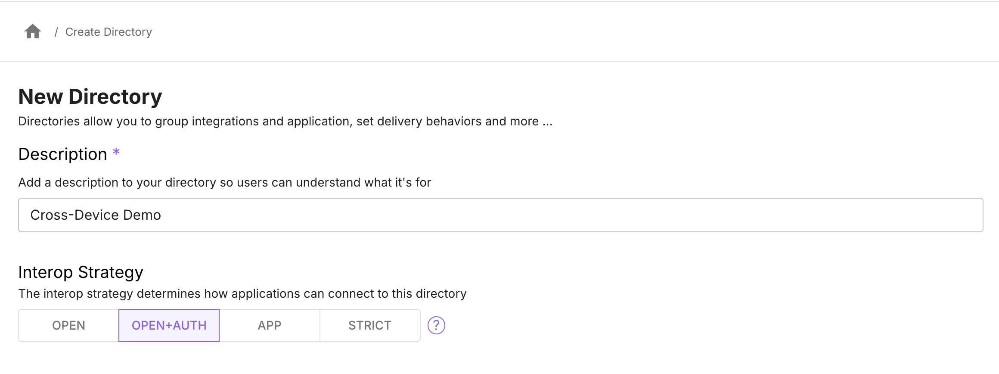
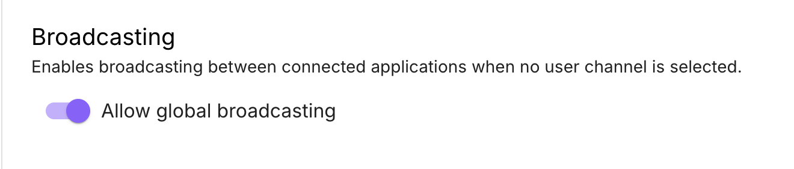
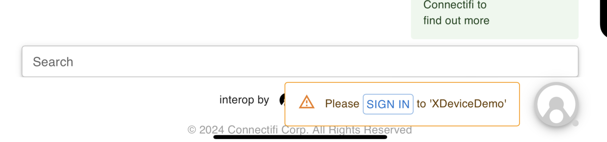
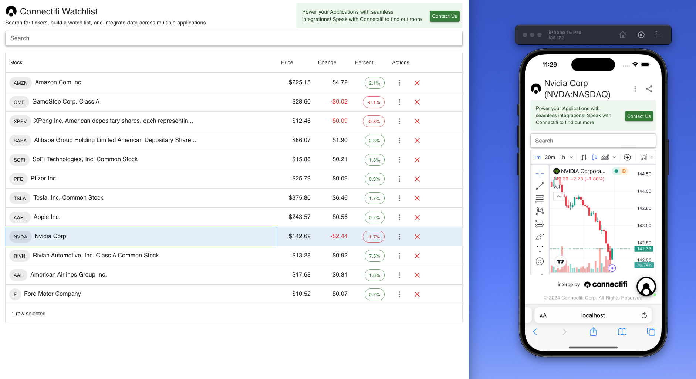
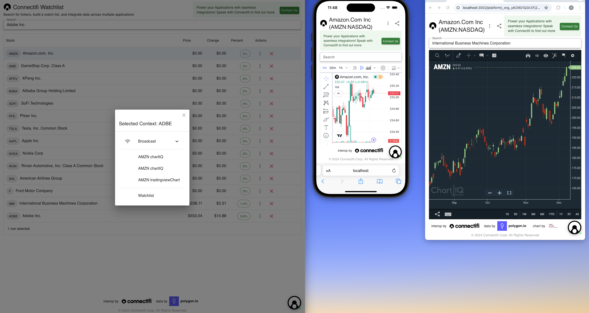

# Building Cross Device Experiences
## Overview
Moving across devices is essential. Workflows should be user-centric, not device-centric, with no friction from sharing data and moving to the next step in a task.  Connectifi provides a complete solution across devices, going far beyond FDC3's focus on the desktop and enabling you to build rich cross-device experiences with ease.

## Ingredients
You will need the following to build this integration: 

- an account with [Connectifi](https://platform.connectifi.app) and a [directory](https://docs.connectifi.co/Directories#creating-directories) configured with auth
- one or more responsive web apps fit for mobile

## Putting It All Together

### Create the Directory
Going cross-device securely requires user identity to be able to bind user sessions.  So, you will need to create a directory with a Interop Strategy of either ‘Open+Auth’ or ‘Strict’. 



In your directory, configure Allow Global Broadcasting to be on. 



This setting simplifies broadcasting by not requiring apps to be set to a color channel for the broadcast to work.  Applications on desktop and mobile will broadcast to each other based on being connected to the same directory and user session.

### Setting Up Demo Applications
First, let’s confirm cross-device connectivity using some demo apps.

Follow these instructions to add the [Watchlist](https://docs.connectifi.co/Sandbox/Demos/watchlist) App and the [TradingView Chart](https://docs.connectifi.co/Sandbox/Demos/tradingviewchart) App to your directory.

Open the Watchlist App on your desktop.  The URL should look like this (substituting your directory identifier): `https://demos.connectifi.app/platform/_org_uKD9G1QGrZFj23qiBz9Ft.XDeviceDemo/watchlist`

Open the ChartIQ App on your phone or phone simulator.  The URL should look like this:

`https://demos.connectifi.app/platform/_org_uKD9G1QGrZFj23qiBz9Ft.XDeviceDemo/tradingviewChart`

You will need to login to Connectifi on both apps.  A toast will be raised from the Connectifi FAB (bottom right of the screen) prompting for login.



With the session established, clicking on a symbol in the Watchlist App on the desktop should now broadcast automatically to the Chart App on the phone.



### Cross-Device Intents Resolution
Applications can be discovered across device with intents.  For example, here is a ‘ViewChart’ intent being raised to browser on desktop and on iOS.  



This is the JSON response that is used to build the resolver.   Note the following properties in the returned *apps* Array:

- **type** - if ‘directory’, the result is a directory entry that can be launched.  If ‘window’, then this is a running instance that can handle the intent.
- **proximity** - this is a score that indicates how ‘proximate’ the running instance to the app instance that raised the intent.  The lower the score, the more proximate.  A 0 indicates that the result is running in the same client and on the same OS as the source.  3 indicates that both client and OS are different.
- **browser** - the browser the result is running in
- **os** - the OS

Together, this information can be used to group and decorate results in a way that is appropriate for the UX of your specific workflow.

```javascript
{
    "intent": {
        "name": "ViewChart",
        "displayName": ""
    },
    "apps": [
        {
            "id": "0615ffcf-66d4-401f-8785-c48703edcb34",
            "type": "window",
            "name": "",
            "appId": "chartIQ@_org_uKD9G1QGrZFj23qiBz9Ft.XDeviceDemo",
            "title": "AWS chartIQ",
            "instanceTitle": "AWS chartIQ",
            "isSecure": false,
            "os": "macOS",
            "device": "Macintosh",
            "browser": "Chrome",
            "icons": [],
            "proximity": 0,
            "lastUpdate": 1733503433654
        },
        {
            "id": "e686b476-f0b7-4beb-8290-03236acb815b",
            "type": "window",
            "name": "",
            "appId": "tradingviewChart@_org_uKD9G1QGrZFj23qiBz9Ft.XDeviceDemo",
            "title": "AWS tradingviewChart",
            "instanceTitle": "AWS tradingviewChart",
            "isSecure": false,
            "os": "iOS",
            "device": "mobile",
            "browser": "Mobile Safari",
            "icons": [],
            "proximity": 3,
            "lastUpdate": 1733502566510
        }
    ],
    "pendingEventId": "raiseIntent_4c6b486e-4c98-4000-ae62-10e5891e82cf",
    "context": {
        "name": "Adobe Systems Inc",
        "type": "fdc3.instrument",
        "id": {
            "ticker": "ADBE"
        }
    }
}
```

## Embellishments

### Customizing the UX
The Connectifi service provides ample data for clients to navigate cross-device workflows and there is also a rich and full featured API for customizing Connectifi UX to suite your specific needs and brand.  You can find the full details from the API documentation here: [https://docs.connectifi.co/SDK/Web](https://docs.connectifi.co/SDK/Web) and a wide number of examples from the open source Getting Started repository here: [https://github.com/connectifi-co/getting-started](https://github.com/connectifi-co/getting-started)

### Offline Mode
Handling offline states is often a big consideration in mobile.  By default, the Connectifi Agent will automatically reconnect when dropped and restored.  The agent also supports APIs for detecting and handling these events.  

```javascript
  onConnected?: (initialConnect: boolean) => void;
  onDisconnected?: (nextConnect?: number) => void;
```

Additionally, any FDC3 API calls made while offline will be rejected with an error of type `ConnectionError.NoConnectionAvailable`. This error can be handled and used to trigger a notification to the user, logging, and/or to queue events to replay when the connection is restored.

### Using the iOS Agent

Connectifi also has an iOS native client that can used to deliver mobile applications.  Read more about it [here](https://docs.connectifi.co/SDK/iOS).

## Clean up & Next Steps
All of the same principals that apply for cross-device on mobile apply to cross-machine, VM, and cross-native clients.  Considerations include:

- Setting user authentication on the directory to safely and cleanly tie sessions together
- Creating a client specific UI, whether this means responsive design, using native components, or simply adopting a consistent look and feel.
- Handling native launching through protocol handlers.
- Providing discoverability across devices and client boundaries in a way that’s navigable and intuitive for the end user.
- Managing offline and disconnect states gracefully.

Once you’ve built these for one scenario with Connectifi, it is easy to apply the patterns across the board to build a solution that provides truly client agnostic interoperability in a scalable and sustainable way.