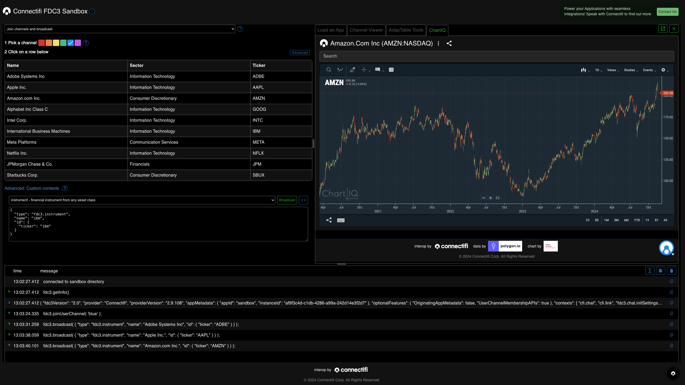
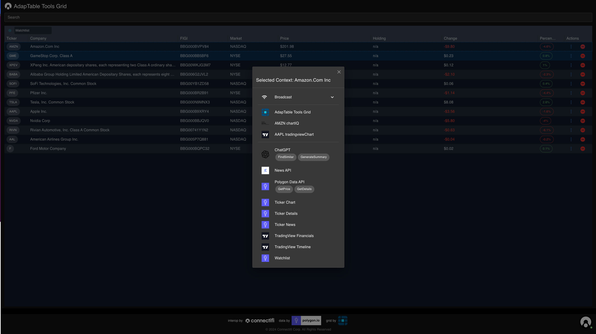
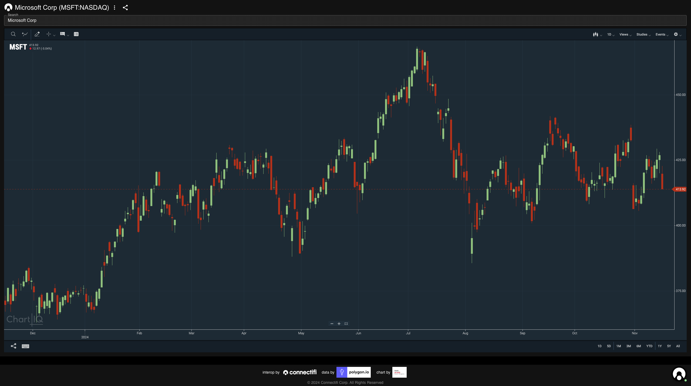
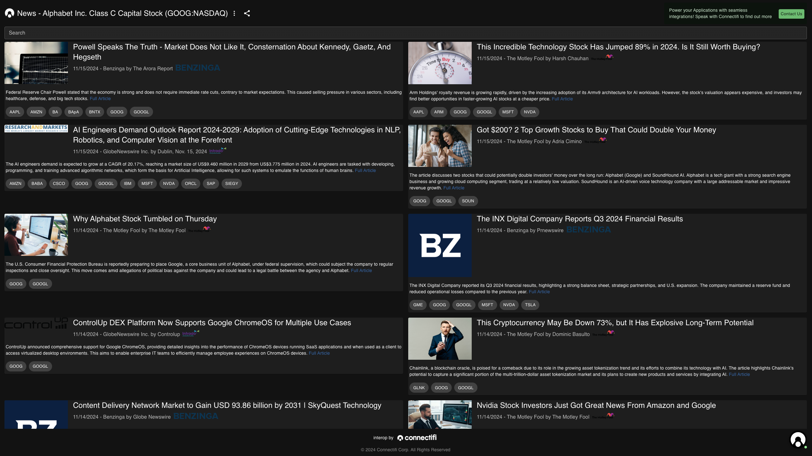
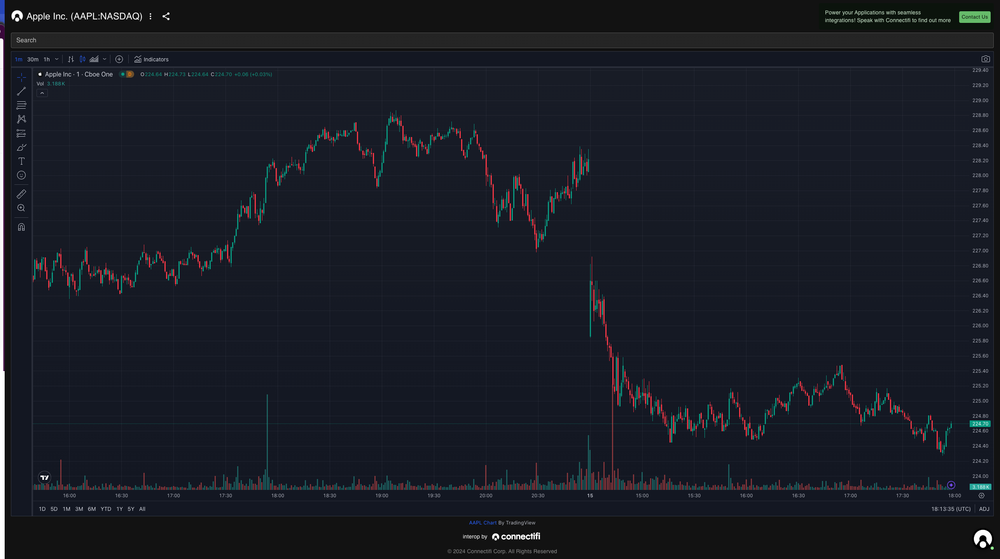
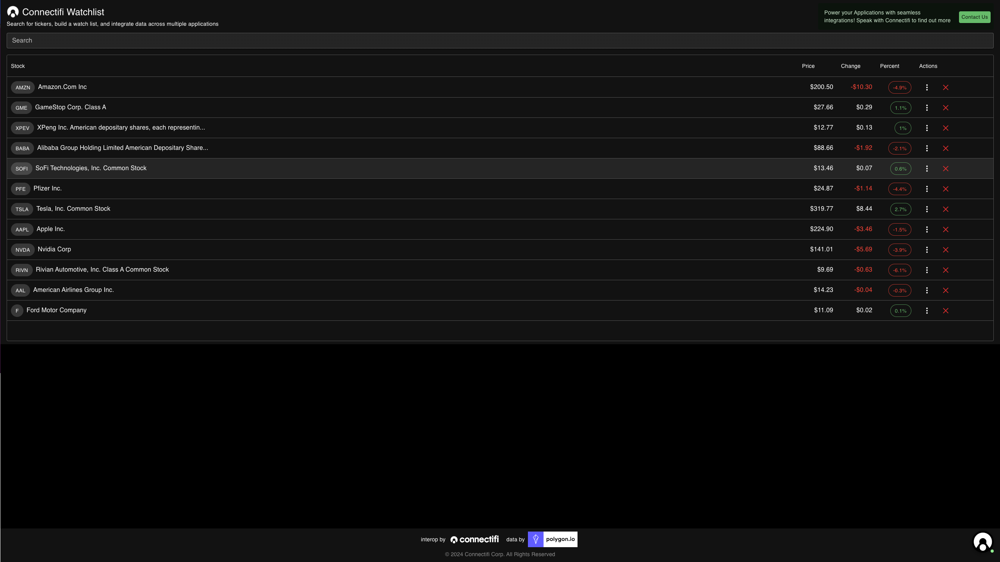

# Using the Connectifi Demo Resources

Connectifi hosts a sandbox environment with dev tools and a number of demo applications that can be used for development, testing, and prototyping.

## Sandbox

The Connectifi Sandbox offers a range of tools for testing the Web Agent SDK using FDC3 APIs including broadcast, channels, and intents.



Visit the Sandbox at [https://apps.connectifi-interop.com/sandbox](https://apps.connectifi-interop.com/sandbox)

## Demos Directory

Connectifi hosts an open demo directory that apps can connect to and who's apps can federated into other directories.  Featured apps include:

### Adaptable Grid
This financial grid from the team at [Adaptable Tools](https://www.adaptabletools.com/) supports intents discovery for any instruments in the grid plus the `SendToWatchlist` to add instruments to the grid view `fdc3.instrument`, `fdc3.instrumentList`, and `fdc3.portfolio` context data.



See it live at [https://apps.connectifi-interop.com/adaptableGrid](https://apps.connectifi-interop.com/adaptableGrid)

### ChartIQ
State of  the art financial charting from the folks at [S&P Global ChartIQ](https://www.spglobal.com/market-intelligence/en/solutions/products/chartiq). This app supports the `ViewChart` Intent for `fdc3.instrument` context data. Market Data provided by our partners at [Polygon.io](https://polygon.io).



See it live at [https://apps.connectifi-interop.com/chartIQChart](https://apps.connectifi-interop.com/chartIQChart)

### Ticker News
Get headlines for a ticker with headlines provided by [Polygon.io](https://polygon.io). This app supports the `ViewNews` Intent for `fdc3.instrument` context data with tagged news stories that let's you discover functionality from entities inline with Intents.



See it live at [https://apps.connectifi-interop.com/tickerNews](https://apps.connectifi-interop.com/tickerNews)

### TradingView Chart
Financial charting by [TradingView](https://tradingview.com). This app supports the `ViewChart` Intent for `fdc3.instrument`.



See it live at [https://apps.connectifi-interop.com/tradingviewChart](https://apps.connectifi-interop.com/tradingviewChart)

### Watchlist
A vanilla financial grid featuring market data by [Polygon.io](https://polygon.io). This app supports intents discovery for any instruments in the grid plus the `SendToWatchlist` to add instruments to the grid view `fdc3.instrument`, `fdc3.instrumentList`, and `fdc3.portfolio` context data.



See it live at [https://apps.connectifi-interop.com/watchlist](https://apps.connectifi-interop.com/watchlist)


### Data Actions
There are multiple data actions available as Intents leveraging data from Polygon.io capabilities from OpenAI and more!


## Connecting to the Sandbox and Demos Directory
The sandbox directory is `Open`, so you can connect any app you want to and integrate with the Sandbox tool or interoperate with any of the Apps and Services in the directory.  

To connect your app, just add the Agent SDK to your web app and run the following connection code:

Using the CDN:

```js
      <script type="module">

      import { createAgent } from 'https://platform.connectifi.app/agent/main.bundle.js';
        const fdc3 = await createAgent(
              `https://platform.connectifi.app`,
              `*@sandbox`,
            );
      </script>
```

Using NPM:

```js
      import { createAgent } from '@connectifi/agent-web';
      const fdc3 = await createAgent(
              `https://platform.connectifi.app`,
              `*@sandbox`,
            );
```

To learn more about using and customizing the Web Agent SDK, checkout our open source [Getting Started](https://github.com/connectifi-co/getting-started) repo!

**Note:** As with all Open directories, if your App is publishing sensitive data, we recommend you don't connect it.