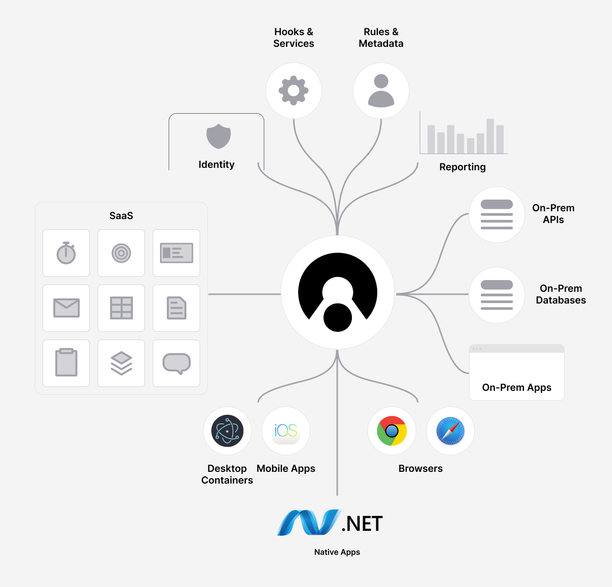

# Get Started with Connectifi in Minutes

[Connectifi](https://connectifi.co) is a cloud service that securely connects applications for interoperability across different technologies and devices. Our platform enables rapid app registration, discovery, and seamless data sharing using our best-in-class FDC3 protocol implementation. Deliver on-demand workflows, secure data exchange, and integrate third-party APIs to effortlessly empower your users. 

**Why Connectifi?**
- **Zero Install:** Works directly in your browser.
- **Full Stack Integration:** Includes no-code administration, client SDKs, REST API connectors, and Web hook triggers.
- **Cross-Device:** Use it on desktops, mobile, and VMs.
- **FDC3 Compliant:** The easiest way to use the FDC3 standard.

Before we dive into the specifics, [get started for free here](https://platform.connectifi.app) to experience Connectifi firsthand. It takes less than a minute to get up and running.

# Components
* A Directory, that defines the application metadata and behavior for the specific integration.  Directories allow the administrator to set what applications can participate in the integration, what functions are supported, and behaviors around data and security.
* Application definitions, that describe how an application can be discovered and called and what functions it supports.  Applications can have:
    * Agent SDKs for integrating the Connectifi service directly into an application client
    * Actions that expose rest APIs for the application
    * Receptors that create web hook triggers
* Metadata that creates a reusable grammar for dynamic interoperability.  Metadata in Connectifi leverages the FDC3 standard, but also supports extensions by organizations.  Metadata can be thought of as nouns and verbs and consists of:
    * Context, metadata that define the data that is exchanged between applications.
    * Intents, metadata that define the actions that applications can support.

## Your Next Steps

Begin your Connectifi journey by [signing up](https://platform.connectifi.app) if you haven’t already! Here's what to do next:
1. **Create and Explore:** Set up a Directory and add applications.
2. **Integrate:** Add the Agent SDK to your app. Use Actions and Receptors for other apps.
3. **Define Interoperability:** Choose or create Intents and Contexts.
4. **Use SDKs:** Add Client SDK triggers or connect the Agent SDK to existing FDC3 APIs.
5. **REST Integration:** Use existing connectors or develop new ones with the Connector SDK.

Remember, Connectifi is designed to grow with you. Start simple and build complexity over time.

[Sign up for free now](https://platform.connectifi.app) and unlock seamless connectivity for your applications!
