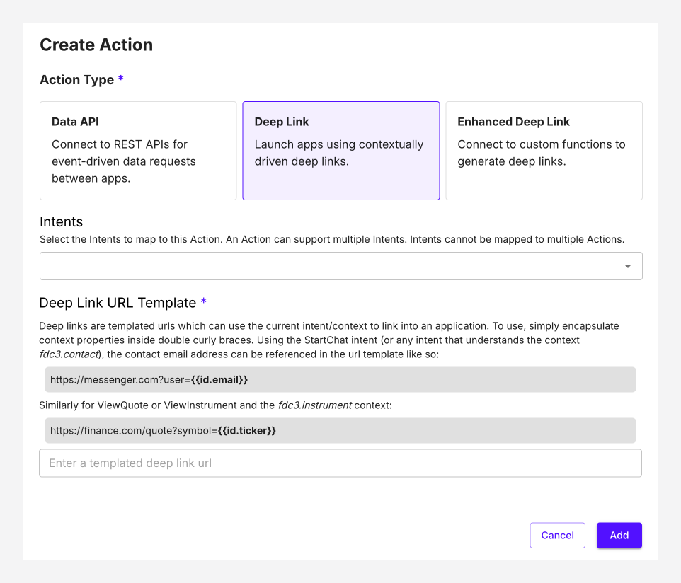

# Deep link

Launch apps using contextually driven deep links.

Deep links are templated urls which can use the current intent/context to link into an application. To use, simply encapsulate context properties inside double curly braces. Using the StartChat intent (or any intent that understands the context fdc3.contact), the contact email address can be referenced in the url template like so:
https://messenger.com?user=\{\{id.email\}\}
Similarly for ViewQuote or ViewInstrument and the fdc3.instrument context:
https://finance.com/quote?symbol=\{\{id.ticker\}\}

