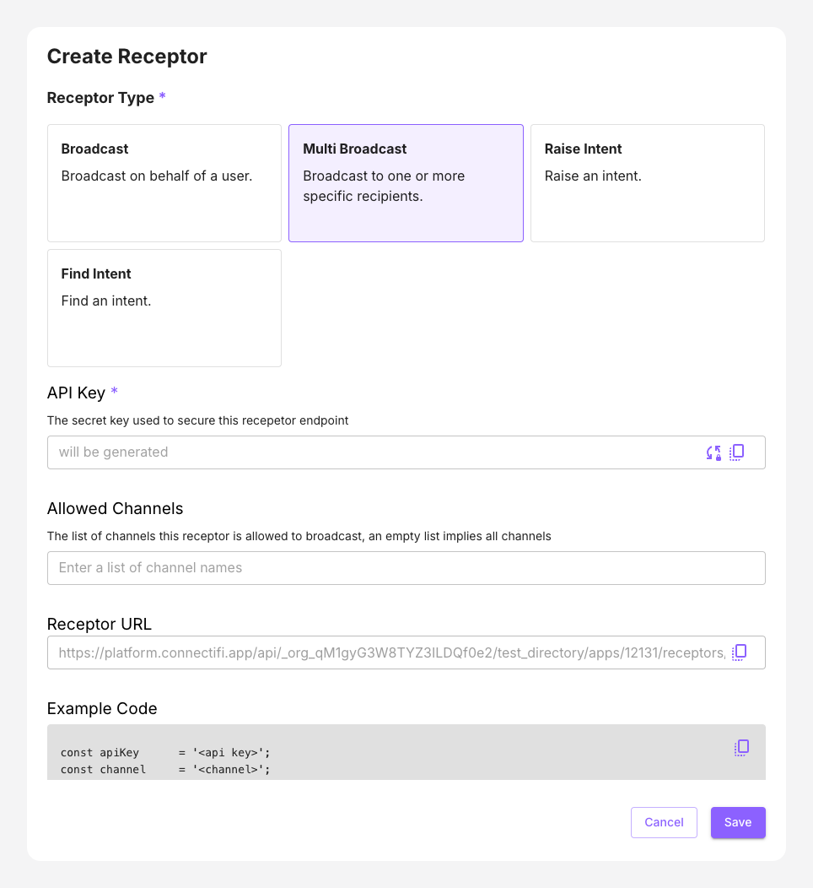

# Multi Broadcast

 This scenario allows you to broadcast contexts on channels to any number of recipients.  Example use cases include:

 - Alerts and notifications services
 - In-app Application announcements
 - Sharing a context across multiple users

### Notes

* Broadcasting must be targeted at specific user sessions; the user's email address specifies the session.
* Broadcasts can be to 'User' Channels (i.e. color channels like 'red', 'blue', etc), or 'App Channels' that are application defined. 
* Broadcasts can also be to the 'global' channel.  If a directory has the 'All global broadcasting' flag set, then broadcasting to the 'global' channel will go to all applications **NOT** joined to a User Channel. 
