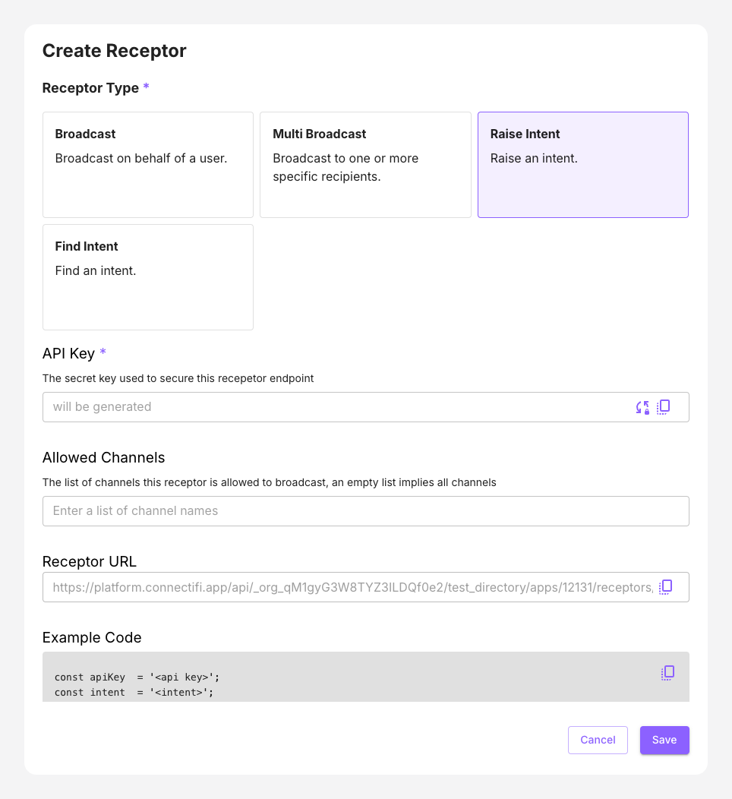

# Raise Intent Receptor

This scenario lets you raise an intent on behalf of a user. If an intent is ambiguous (more than one application is found that can handle the intent), the available options will be returned.  Providing a target in the call will fix the intent to a specific app.

- `From` header is the email of who you want to raise the intent on behalf of. 

