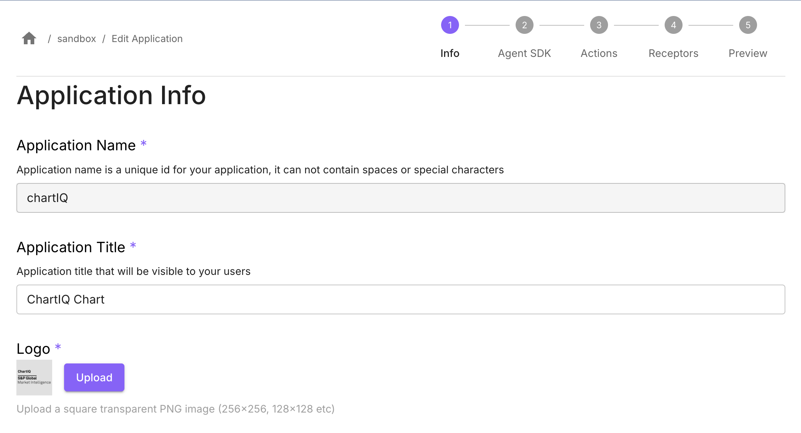
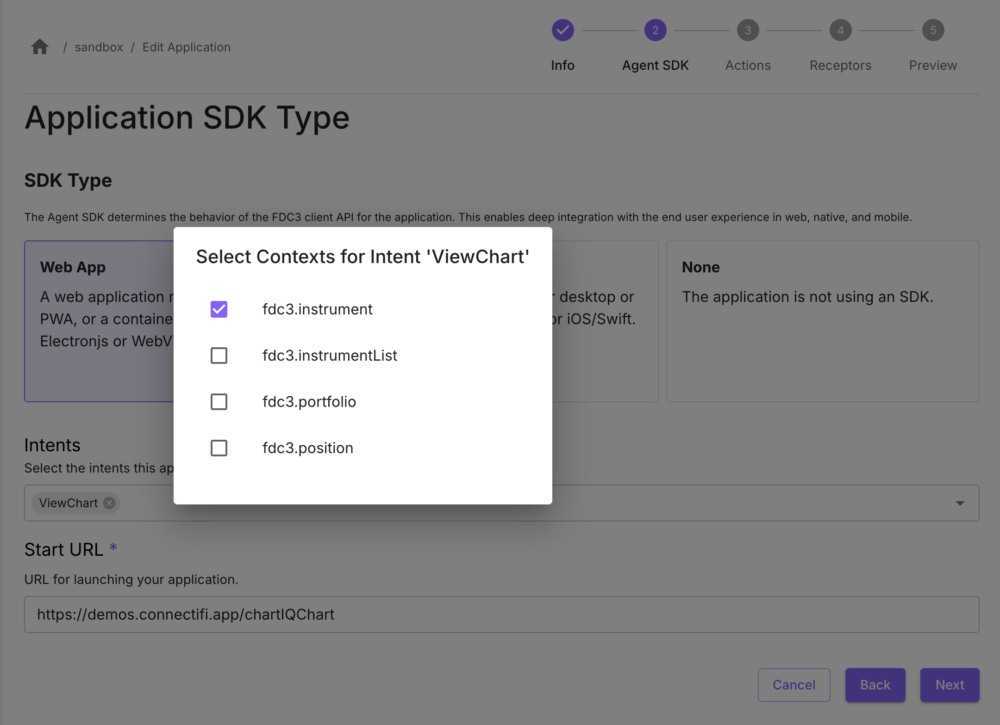

# ChartIQ
[ChartIQ](https://www.spglobal.com/market-intelligence/en/solutions/products/chartiq) is an advanced data visualization and charting solution crafted to meet the needs of financial market participants seeking to uncover and share insights derived from an extensive array of information.

## Application Name
In the **Application Info** step, set *Application Name* as `chartIQ`.

## Start URL & Intents

In the **Agent SDK** step, select SDK Type of *Web App*.

Set *Start URL* as (substituting the code for your directory as described [earlier](/Sandbox/Imports)): `https://demos.connectifi.app/platform/{YOUR_DIRECTORY_CODE}/chartIQChart`

### Configure Supported Intents
This registers the intents the app supports with the directory, so that the app is fully discoverable and can be launched using the *start url* provided.

Select the Intent: `ViewChart`

Select the following supported Contexts: 
- `fdc3.instrument`

**Note:** once you’ve added an intent, click on the chip for the intent to get the picker list for contexts.

## Finish

Got to the **Preview** step, check your settings, and select *Finish* to save the application.  

Test the app using its Start URL, it should load and connect to the directory. If it has registered intents, it will now be discoverable.