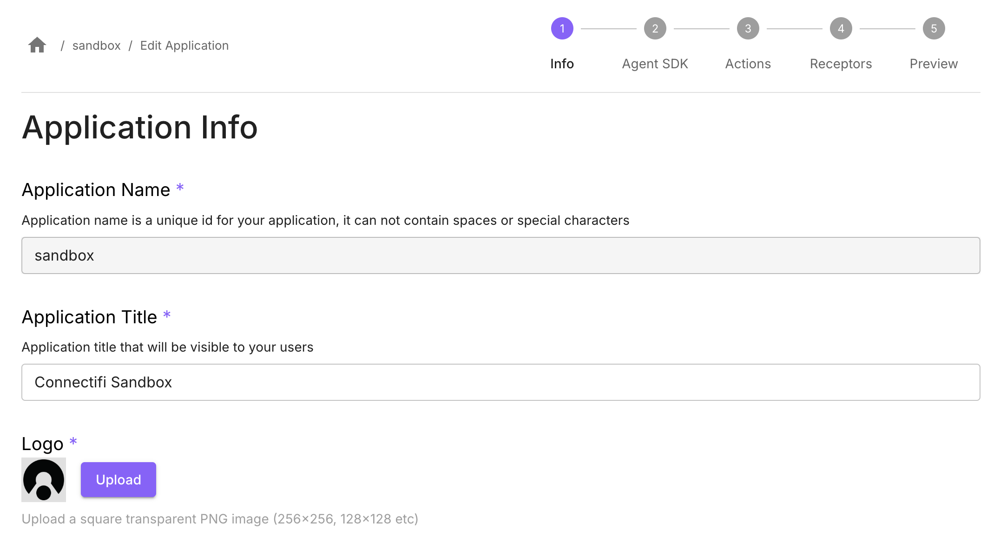

# Sandbox
The Connectifi Sandbox is an invaluable developer tool and the easiest way to get started with FDC3 and the Connectifi Agent SDK.

## Application Name
In the **Application Info** step, set *Application Name* as `sandbox`.

## Start URL & Intents

In the **Agent SDK** step, select SDK Type of *Web App*.

Set *Start URL* as (substituting the code for your directory as described [earlier](/Sandbox/Imports)): `https://demos.connectifi.app/platform/{YOUR_DIRECTORY_CODE}/sandbox`

### Configure Supported Intents
Then Sandbox app doesn't have any Intents to register.

## Finish

Got to the **Preview** step, check your settings, and select *Finish* to save the application.  

Test the app using its Start URL, it should load and connect to the directory. If it has registered intents, it will now be discoverable.