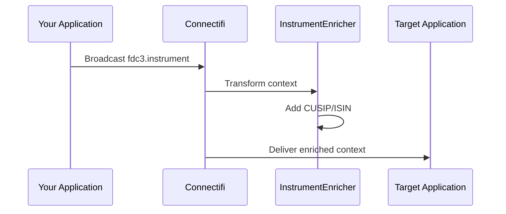

# Delivery Hooks - add fields to context

This is draft content, the robot did it.

```mermaid
sequenceDiagram
    participant AppA as Your Application
    participant Connectifi
    participant Hook as InstrumentEnricher
    participant AppB as Target Application

    AppA->>Connectifi: Broadcast fdc3.instrument
    Connectifi->>Hook: Transform context
    Hook->>Hook: Add CUSIP/ISIN
    Connectifi->>AppB: Deliver enriched context
```